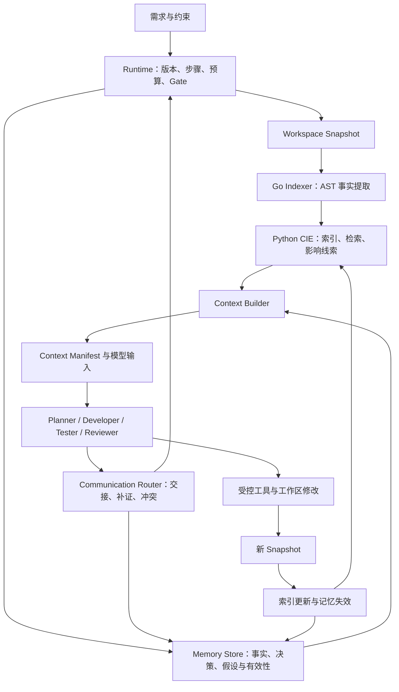

# MASA：代码理解、记忆、上下文与多 Agent 协作详细设计

> 版本：v0.3 / 2026-09-26。前序规划方向已获用户认可，按本轮优化取舍修订。
> 状态：领域详细设计。P0 与 P1-01～P1-03 最小实现已完成，见下方实施落点和 STATUS_PROJECT；完整多角色机制及效果指标仍待后续实现和评估。
> 总体边界见 [架构总纲](DESIGN_RUNTIME_ARCHITECTURE.md)；环境历史见 [环境说明](ENV_LOCAL_SETUP.md)。动态规划、经验与路由见 [优化设计](DESIGN_ADAPTIVE_OPTIMIZATION.md)。
> 当前执行顺序以 [优先级路线](PLAN_PRIORITY_ROADMAP.md) 为准；本文件第 13 节旧任务仅作追溯。文中 MVP 对应 P1：完整有界交接与确定性裁剪必做，delta、模型摘要、增量索引移至 P2。原始 Project Plan 仅为归档愿景。

## 2026-09-27 实施落点：P1-02/P1-03

当前最小实现见 [使用说明](USER_CODE_INTELLIGENCE_GUIDE.md)：`runner/internal/indexer` 提取 AST；`intelligence.py` 发布 versioned generation 与确定性检索；`memory.py` 保存 run 内来源与失效；`context.py` 按角色和预算组装；开启 intelligence 后 AgentLoop 每次实际调用都经过 Builder。后文更完整的 schema 和实验仍属于设计目标。

本轮明确取舍：全量索引以不可变 JSON artifact 保存，SQLite 仅存 generation 指针，不提前拆节点/边表；词法扫描替代原先首选的 FTS5，返回 backend 名称，不声称启用全文数据库；结构展开限一跳。记忆按整个 snapshot/profile 保守失效并传播依赖，下次读取时更新 stale；无跨 run 复用。上下文使用 UTF-8 字节硬上限和保守 token 估计，真实 usage 尚未接入。四角色输出、交接、完整 diff 材料和角色写权限随 P1-04/P1-05 接入；本轮的 role 是材料视图，不代表角色 Agent 已运行。

generation 只在完整解析输出通过路径/哈希校验后事务发布；partial 表示存在语法诊断，不等于截断输出。索引读操作中断可重新构建，每次调用仍扣 run 工具预算；它不进入可能产生写副作用的未知工具重放路径。

技术依据：[Go parser](https://pkg.go.dev/go/parser)、[Go AST](https://pkg.go.dev/go/ast)。类型绑定、构建标签精确选择、完整调用图均未实现。

建议审核顺序：先读第 1、2 节确认主线和规模，再读第 4～8 节审查关键机制，最后读第 10、12～14 节确认演示、评估与工作量。第 3、9 节是后续实现必须遵守的数据与恢复契约。

## 1. 核心方向：让协作建立在可验证、可更新的代码证据上

项目的主问题是：**当多个角色持续修改同一代码库时，如何让每次决策获得足够、当前有效且成本可控的信息？**

传统流程容易出现三个问题：搜索结果只给文件片段、角色互相转发长摘要、代码变化后沿用旧结论。MASA 选择把它们统一处理：代码事实有版本与来源，记忆有适用范围，上下文有选择记录，通信有明确消费方与版本前提。

三个拟验证亮点：

| 亮点 | 具体机制 | 用户能看到什么 | 验证方式 |
|---|---|---|---|
| Codebase Understanding Engine | 代码地图、符号索引、分层定位、关系证据、变更影响线索 | 为什么定位这些文件、还遗漏哪些关系 | 标注查询的定位召回、跨文件修复案例 |
| Evidence-aware Context Management | 版本化记忆、按角色选材、预算、摘要溯源、失效传播 | 每次模型调用看了什么、为什么旧结论被移除 | 过期注入测试、证据覆盖、输入 tokens |
| Multi-Agent Communication Optimization | 结构化交接、共享 artifact、按需补证、增量消费 | 哪个角色收到哪些新增事实、减少了哪些重复检索 | 消融实验、重复上下文比例、最终验收通过率 |

这三者都是工程设计方向，不能仅因使用这些名称就宣称原创算法或优于现有系统。重点是把它们贯穿到同一条可恢复执行链，并用关闭某一机制的对照实验说明作用。

### 1.1 范围分层

| 层级 | 包含内容 | 是否是此次目标 |
|---|---|---|
| 最小运行基础 | 工具执行、状态机、工作区与版本、单步骤恢复 | 必须，但单独完成不足以构成亮点 demo |
| 亮点 demo | AST 代码地图、结构检索、分层记忆、Context Builder、交接与补证、变更失效、评估 | 本设计建议审核通过后实施 |
| 增强层 | P2 经验复用/策略评估、delta/模型摘要；P3 类型与向量能力 | 不阻塞 P1；结构 Experience 记录在 P1 实现 |
| 工程化层 | 多机器 worker、远程执行、容器隔离、Web/IDE、权限与多租户 | 本次不实施 |

一个 Python 进程、一种 SQLite 存储、一个 Go 二进制足够支撑亮点 demo。CIE、Memory、Context、Communication 是内部模块，不是四个服务，也不是四个新 agent。

### 1.2 两个名称的统一

`Code Intelligence Engine (CIE)` 是代码分析与检索模块的正式名称；`Codebase Understanding Engine` 是它对外提供的仓库理解能力，包括地图、定位、关系与影响说明。两者不拆成重复组件。

理解分为三层：确定性程序事实（声明、imports、测试退出码），分析得到的关系（语法候选或类型解析），模型提出的解释（职责、缺陷原因、改动建议）。每层都标注来源和边界。即使类型分析成功，也不宣称理解了全部业务语义。

## 2. 系统边界与端到端数据流



各模块只有一个核心责任：

| 模块 | 拥有的决策 | 不拥有的决策 |
|---|---|---|
| Runtime | 校验图与重规划、调度、预算、终态、恢复 | 不自行编造代码事实或放宽验收 |
| CIE | 哪些代码证据与查询有关、关系的可靠程度 | 不决定任务成功，不自行修改代码 |
| Memory Store | 记录来源、作用域、状态与失效依赖 | 不把自然语言结论自动认证为事实 |
| Context Builder | 每次调用的输入材料、粒度与 token 分配 | 不扩大工具权限或修改用户目标 |
| Communication Router | 交给哪个角色、如何去重与恢复消费 | 不生成自治 agent 网络 |
| Go 工具模块 | 代码事实提取、命令执行与结构化结果 | 不持有项目业务数据库、对话记忆或调度权 |

调用顺序是 Runtime 固定快照 → CIE 检索 → Memory 查询有效记录 → Context Builder 组装 → AgentLoop 执行 → Router 校验输出 → 持久化交接 → Runtime 推进。任何角色都不能绕过 Context Builder 把完整历史直接拼入 prompt。

## 3. 统一版本与证据契约

### 3.1 WorkspaceSnapshot：先解决“这份信息对应哪份代码”

只记录 Git commit 不够：agent 的未提交修改也会改变代码。每个可读视图必须有 `snapshot_id`，由受控工作区文件清单及其内容哈希计算；清单包含纳入分析的未跟踪文件。模型不得自行填写 snapshot_id。

Snapshot 字段：`repo_id, workspace_id, snapshot_id, base_commit, manifest_ref, build_profile_id, created_at`。manifest 按规范化相对路径排序，记录内容哈希、文件类型与排除原因；Windows 路径大小写按已检测文件系统规则规范化，不能跨平台一律小写。

`build_profile_id` 描述 GOOS、GOARCH、build tags、CGO、Go 版本和模块依赖状态。相同源码在不同构建配置下不能直接复用类型分析结果。运行环境、索引器版本、schema 版本另纳入缓存 key。

Demo 在每次文件写工具成功后更新受影响文件哈希；步骤边界再次核对完整清单。索引和并行验证使用冻结副本。写步骤内查询使用最近一次确认的工作快照，外部修改或读写竞争导致核对失败时停止使用旧结果。

### 3.2 EvidenceRef：跨模块通用的证据引用

```json
{
  "evidence_id": "ev-0031",
  "repo_id": "repo-demo",
  "snapshot_id": "snap-A",
  "kind": "source_range",
  "artifact_id": "blob-018",
  "path": "internal/paging/page.go",
  "start_line": 12,
  "end_line": 35,
  "content_hash": "sha256:example",
  "symbol_key": "demo/internal/paging::func::Normalize",
  "producer": "go_ast",
  "analysis_level": "syntax",
  "limitations": []
}
```

该 JSON 是字段示例，哈希与 ID 是占位值。运行时使用真实哈希。源码范围、测试日志、diff、用户指令分别有不同 kind，不强迫每种证据都带行号。

`symbol_key` 用于同版本查找与跨版本候选匹配，包含模块/包、声明类型、接收者和名称；不能假设重命名、移动文件后保持稳定。`symbol_version_id` 另绑定 snapshot、范围与哈希。行号用于展示，内容身份由哈希与快照决定。

### 3.3 证据与结论的关系

| 类别 | 示例 | 是否能直接当作当前代码事实 |
|---|---|---|
| observed | “snap-A 的函数签名为 Normalize(page, size int)” | 证据匹配当前快照时可以 |
| measured | “snap-A 在 profile-P 下 TestPage 失败” | 仅限该快照、命令、环境与测试范围 |
| inferred | “可能是 size=0 导致除零” | 不可以，必须携带待验证项 |
| decision | “本轮保持公开函数签名不变” | 是任务约束，不是代码运行事实 |
| convention | “该仓库使用显式错误返回” | 需要指定来源、适用范围和确认状态 |

不要用一个 confidence=0.93 掩盖分析能力不足。MVP 使用明确类别、来源、resolution 和 limitations；未来只有经过校准才引入概率。

## 4. 记忆系统：存什么、何时用、什么时候失效

### 4.1 五种记忆与生命周期

| 记忆种类 | 内容 | 作用域 | 写入方 | 生命周期 |
|---|---|---|---|---|
| Task Contract | 原始目标、验收项、权限、当前计划版本 | Run | 用户输入 + Runtime 审核后的 Plan | 固定保留；修改建立新版本 |
| Working Memory | 当前角色局部进度、待验证假设、下一步 | Step/Attempt | AgentLoop 输出、工具观察 | 本步骤有效；压缩后保留 unresolved |
| Repository Memory | 代码结构、职责候选、可核验约定 | Repo + Snapshot/Profile | CIE 或带来源的总结 | 依赖代码/配置变化时失效 |
| Episodic Memory | 本次修复做过什么、失败原因、验证结果 | Run/Round | Runtime + 结构化交接 | Run 内可检索；保留历史，不能直接当当前事实 |
| Reusable Memory | 跨任务约定与已验证策略 | Repo/任务类别 + 前提条件 | P2 显式 promotion 流程 | P1 记录 Experience，P2 才检索与晋升 |

MVP 的“长任务记忆”主要是 Run 内跨步骤与重启恢复，不等于搭建一个向量数据库。代码索引也不等于 memory：前者是可重建事实缓存，后者还记录决策、假设、失败经历和知识状态。

### 4.2 MemoryRecord 字段与状态

最少字段：`id, kind, scope, repo_id, run_id, producer_step_id, statement, epistemic_status, evidence_refs[], dependency_keys[], valid_for_snapshot, build_profile_id, created_at, status, supersedes, conflict_group`。

`epistemic_status` 取 observed/measured/inferred/decision/convention，`status` 取 candidate/active/stale/superseded/rejected。二者分开：active hypothesis 仍然是 hypothesis，不会因为被多次引用变成事实。

依赖 key 支持文件哈希、symbol version、Plan version、测试配置、上游 memory id。MVP 不追求字段级语义精确失效：依赖一个文件就对文件变化保守失效。依赖不明确的模型仓库总结默认绑定整个 snapshot，修改后失效；避免靠模型猜测漏掉依赖。

### 4.3 写入与晋升

1. Runtime 为工具结果生成 observed/measured 记录，校验结果对应的 workspace、snapshot、配置和命令。
2. 模型输出只能提交 candidate，包括事实候选、解释或建议；检查引用存在只能证明“有来源”，不能证明自然语言解释成立。
3. 结构事实可由确定性规则核对；故障解释有可重复的测试证据后，可补充支持它的 evidence_refs 并转为 active，但 epistemic_status 仍为 inferred。一次测试成功不等于证明了唯一原因。
4. 角色决策由 runtime 检查是否符合 Task Contract 后激活；有歧义或超范围则 needs_attention。
5. 跨任务经验的 promotion 不在 MVP 中自动发生。增强层要求明确前提、关联成功 run、反例检查和人工可撤销状态，不能将一次修复总结当通用规则。

禁止写入：API key、环境密钥、原始隐藏推理、与任务无关的用户信息。代码注释与 README 是被分析的数据；即使被记入 memory，也不能获得工具授权或覆盖用户指令。

### 4.4 检索与优先级

先按 repo、权限、run、snapshot/profile、状态过滤，再排序；不能先做相似度排名然后忽略有效性。优先顺序：当前 Task Contract → 当前失败和未解决项 → 当前代码证据 → 本轮决策 → 经重新核对仍适用的旧记录。

旧 episodic 记录可作为“上一轮曾观察到”的历史供参考，但不能支撑当前测试已通过。被拒绝的假设只在防止重复尝试时作为明确标注的反例出现。

相关性来自验收项、符号/路径、失败测试 ID 和轮次；MVP 用确定性过滤与文本检索。向量相似度即使后续引入，也只能改善候选召回，不能突破作用域和有效性规则。

### 4.5 失效传播

```text
代码工具提交变更
  -> 生成 snap-B 与 changed_paths
  -> 索引 A 标记为不可用于 B 的当前查询
  -> 找到依赖 changed_paths / plan / profile 的 MemoryRecord
  -> 标记 stale，沿 memory dependency 向摘要与交接传播
  -> 废弃引用这些材料的 ContextManifest 缓存
  -> 保留历史 artifact；为 B 按需重新索引与补证
```

对 unchanged 文件，可以验证哈希相同后为 B 创建新的适用性记录，引用相同不可变内容；不能修改 A 的历史出处。语义关系依赖包级输入，即使该文件未改，也可能因被调用函数签名变化失效，类型层按包与反向依赖重新验证。

删除文件创建 tombstone；不能只更新新增文件而让旧符号继续命中。重命名以删旧增新为正确性基线，rename 匹配只是优化。新索引在事务中发布 generation 完成状态，未完成的 generation 不可作为完整索引查询。

### 4.6 冲突、遗忘与存储回收

同一命题出现不同结论时保留两条记录并建立 conflict_group；不做最后写入覆盖。相同 snapshot 下的两个矛盾工具事实触发 integrity_error；模型推断与工具事实冲突时保留推断为待澄清，不让多数角色投票覆盖证据。

“从上下文省略”“知识失效”“删除存储”是三件事。上下文可省略低优先级事实，但仍可检索；stale 记录保留供回放；artifact 仅在无存活引用且超过保留期后回收。MVP 先提供显式删除某个 run 的未来设计，自动 GC 延后，不能为省空间破坏恢复。

### 4.7 摘要与压缩协议（确定性裁剪 P1，模型摘要 P2）

优先做确定性压缩：删除重复内容、提取失败日志、把整文件降为签名和相关范围；仅在旧局部会话仍占预算时使用模型摘要。

摘要 schema：`goal, completed_actions[], active_decisions[], hypotheses[], rejected_hypotheses[], unresolved[], evidence_refs[], next_actions[], covered_event_seq`。每条内容保存 evidence 或 event 来源，摘要版本绑定原始事件范围和快照。

压缩规则：

- 用户约束、验收项 ID、当前错误位置、未解决阻断项不可丢失。
- 假设保持不确定措辞；“曾测试成功”必须带版本与命令范围。
- 保留最近一组完整 tool call/result 配对，不能破坏 provider 消息序列约束。
- 摘要必须可回到原事件；不反复对摘要再摘要而抛弃原始输入。
- 校验覆盖的未解决项 ID 完整、引用可解析、预算满足；不通过则缩小摘要范围或使用确定性模板。

结构校验无法证明自然语言摘要完全无损，因此关键事实直接从结构字段重建，重要源码与当前失败日志不依赖摘要。压缩操作记录额外模型 tokens 和延迟，计入总成本。

## 5. Context Builder：把记忆与代码证据编译成一次可执行输入

### 5.1 输入与输出

输入：`role, task_contract_version, step_id, snapshot_id, query_intent, available_budget, relevant_message_ids`。

输出包含两部分：实际 provider messages/tool definitions 与持久化 `ContextManifest`。manifest 描述“看了什么以及为什么”，不是完整 prompt 的替代品。

ContextManifest 字段：`id, model_config_hash, role, snapshot_id, policy_version, task_version, memory_ids, message_ids, selected_evidence[], omitted_candidates[], token_estimate, estimate_method, budget, prompt_artifact_ref`。每条 selected_evidence 记录粒度、范围、引入原因和选取分数；omitted_candidates 只保留有界数量与原因，避免审计日志无限增长。

prompt_artifact 保存脱敏后的实际请求；去掉密钥，但不悄悄删掉导致复现不一致的代码片段。即使相同输入可重建，也不保证模型回答确定；“上下文回放”与“模型结果重现”必须区分。

### 5.2 预算模型

```text
B_material = min(B_run_call_cap, W_model - B_output_reserve - B_margin)
             - B_instructions - B_tool_schemas
```

模型上下文窗口、输出限制和 tokenizer 由 provider 配置；不在文档硬编码某个商业模型的永久参数。tool schema、序列化开销和历史消息都要计费。没有准确 tokenizer 时记录估计方法并使用保守余量；服务端拒绝超限后执行一次受控降级，不能无穷重试。

示例仅用于设计：材料预算 12,000 tokens，Task Contract 1,200，当前代码 5,400，验证证据 2,400，交接与局部记忆 1,800，按需补证预留 1,200。实际比例按角色改变，不承诺这些数字最优。

Mandatory 内容超过预算时返回 `context_insufficient`，先尝试拆分步骤或定向补证；不能删除用户约束再调用模型。Mandatory 是验收项、权限和关键证据等最小内容，不是所有候选代码。

### 5.3 选择算法与粒度

1. 固定 snapshot/profile，过滤 stale、权限不符和解析失败的证据。
2. 加入 Task Contract、当前操作目标、当前阻断失败及必要工具定义。
3. CIE 返回分层检索候选；Memory 和 Router 返回有效记忆与待消费交接。
4. 用内容哈希 + 证据范围去重，合并重叠源码段，保留来源关系。
5. 按角色与验收项覆盖排序；为同一证据选择地图、签名、函数体、完整文件等粒度之一。
6. 在预算内按新增覆盖收益/估计 token 成本贪心选取；已由某段覆盖的同一验收项不重复加分。
7. 输出 omissions、缺失证据与下一次可用查询，持久化 manifest 后请求模型。

初始排序使用配置化小整数规则，例如精确路径/符号匹配、直接失败位置、当前 diff 加分；图候选和仅名称相似项次之。规则由离线标注集调节并留版本，不写“最优 relevance 算法”。任何分数都不能覆盖 validity 过滤。

粒度降级优先顺序：去重 → 无关日志移出 → 低相关整文件变函数体 → 非目标实现变签名 → 旧交接变结构摘要 → 拆分当前步骤。正在修改的函数不能只给摘要；跨函数改动需包括被依赖契约与相关调用方。

### 5.4 角色上下文差异

| 角色 | 必需信息 | 优先追加 | 默认不追加 |
|---|---|---|---|
| Planner | 需求、验收、代码地图、入口与模块关系 | 高相关符号签名、历史约束来源 | 大量函数实现与全部测试日志 |
| Developer | 当前目标实现、依赖契约、调用方证据、阻断 findings | 相关测试、上轮失败尝试 | 所有角色完整会话 |
| Tester | 验收项、公开契约、改动范围、现有测试 | 边界条件与失败反例 | Developer 未验证解释作为既定事实 |
| Reviewer | 当前 diff、相关上下文、验收项、影响范围 | 独立检索到的调用方与风险 | 作者的自我肯定结论 |

Reviewer 与 GoCheck 并行时不等待本轮测试结果；它检查当前代码与已知历史事实。两者完成后 Gate 汇聚。本轮测试结果不能提前出现在 Reviewer 的输入中。评估时可增加 reviewer 冷启动，只给 diff/契约以衡量协作中的锚定偏差。

### 5.5 按需补证与停止条件

Agent 可以提出 `EvidenceRequest`，如“给出 Normalize 的当前调用方线索及测试”，由 runtime 路由到 CIE；不是请求启动一个新的 agent。每个步骤默认最多两轮额外补证，每轮扩大一层范围或改变检索词，消耗工具与 run 预算。

补证返回新增证据、已有证据 ID、unknowns 和索引 coverage；若没有新信息，明确 no_new_evidence。重复相同查询、相同 snapshot、相同 options 可复用结果；对测试执行结果不套用普通搜索缓存。

上下文覆盖率低只能提示不确定性，不能声称模型自信即足够。预算耗尽且缺少关键证据时 needs_attention 或失败；实际测试失败则进入修复路径。

### 5.6 缓存与审计

Context 缓存 key 包含 snapshot/profile、role、Task Contract 版本、消息集合版本、memory 版本、查询、budget、policy 和模型配置。命中前仍检查证据有效性。稳定前缀可以方便后续 provider 缓存，但本地 manifest 命中不等于模型输入 tokens 免费，实际 usage 单独记录。

每次构建产生 `context_built`，材料失效产生 `context_invalidated`，压缩产生 `memory_compacted`。记录被剔除的原因，以便演示“因为 page.go 已变化，上一轮分页约定不再进入 Developer 上下文”。

## 6. Code Intelligence Engine：Go 优先的分层代码理解

### 6.1 能力等级与交付边界

| 等级 | 能力 | 实现方向 | 进入范围 |
|---|---|---|---|
| L0 文件视图 | 目录、模块、文件类型、哈希、搜索 | Python 清单 + 文本索引 | 运行基础 |
| L1 语法结构 | Go 声明、函数/方法签名、imports、测试、位置 | Go parser/AST/token | 亮点 demo 必须 |
| L2 构建与类型 | 当前构建文件、类型对象、引用、可解析的直接调用 | go/packages + go/types | 增强层 |
| L3 深层分析 | SSA、数据流、动态调用近似、跨语言 | 独立评估后引入 | 不进入本轮实现范围 |

Go 官方的 [go/parser](https://pkg.go.dev/go/parser) 和 [go/ast](https://pkg.go.dev/go/ast) 提供语法解析与树结构；这些能力足够构建 L1，但不等同于名称绑定和完整调用图。

### 6.2 L1 提取内容

Go `go_index` 输入为可信 snapshot 根、profile 和受限相对文件列表；单次进程可批量分析多个文件，避免每个符号启动一次。输出包/文件/声明/候选关系/diagnostics 的结构化事实。若输出达到上限，标记 partial 和未完成文件，禁止静默截断成“完整索引”。

提取字段：文件路径和哈希、package clause、import path/alias、类型/常量/变量声明、函数和方法、接收者、参数与结果文本、注释范围、起止偏移与行号、`TestXxx` 等测试声明、调用表达式的文本目标与所在函数。

边类型采用白名单：`contains, declares, imports, has_signature, syntax_calls, name_matches_test`。其中 syntax_calls 只表示该函数出现调用表达式，`x.List()` 不足以确定 x 的类型；name_matches_test 只是测试候选，不等于测试覆盖关系。

匿名函数记录 file-local occurrence ID；方法接收者区分不同类型；同名符号展示完整包与 receiver。生成文件默认保留存在信息但不优先作为修改目标，vendor、缓存和工具目录不递归扫描。go:generate 指令只记录，不执行。

### 6.3 构建约束与解析失败

L1 可以展示所有纳入清单的源码，并解析 build constraint 元数据，但不能冒充“这些文件必定同时参与当前构建”。L1 对约束未完全判断的文件标 `build_inclusion=unknown`；上下文必须能看到该限制。

语法错误时保留成功解析的声明与 diagnostics，并对该文件标 partial；未确认范围回退文本搜索。类型依赖缺失不阻止 L1，不能因为增强层失效就让代码检索全不可用。源代码损坏导致无结果时返回 unindexed，而不是“不存在该符号”。

### 6.4 L2 类型增强（延后）

[go/packages](https://pkg.go.dev/golang.org/x/tools/go/packages) 可按模式加载包并按配置获取源码、imports 和类型信息；[go/types](https://pkg.go.dev/go/types) 提供类型检查相关结构。增强层据此构建对象引用和可解析调用关系。

约定记录 build profile、测试包变体、模块版本与 package diagnostics。直接调用可解析为 typed edge；接口分派、反射、函数值、泛型相关不完整关系标 unknown/candidate。不能把静态候选当运行时必达路径，无法解析时维持 L1。

依赖下载必须受工具策略约束，默认先使用已有模块缓存，不由一次索引隐式改变 go.mod/go.sum。外部 GOPACKAGESDRIVER 默认禁用或要求明确允许；加载过程受 deadline 与资源边界控制。依赖版本在实际实施时验证与锁定，本轮不安装 x/tools。

### 6.5 代码地图与职责摘要

地图分为 repo → module/package → file → symbol 四层。第一屏展示构建入口、内部包与 imports、测试分布、索引 coverage；按任务展开相关区域。不要把全部符号列表一次塞给 Planner。

确定性事实可以模板生成摘要，如“paging 包声明 2 个函数，被 handler 包导入”。“该包负责规范化所有分页行为”属于模型推断，必须引用实现、调用点或文档，不能根据包名猜定。

MVP 只按需总结检索到的包/符号，不逐文件调用模型做全仓库摘要。摘要缓存依赖证据哈希；摘要附 unknowns，例如“尚未确认批量导出接口是否复用该函数”。

### 6.6 变更影响分析

输入 ChangeSet 与 before/after snapshot；输出受影响声明、直接 imports/候选引用、相关测试候选、证据路径及盲区。

L1 的影响路径示例：`page.go 改动 → 同包 Normalize 声明 → handler.go 包含相关调用表达式 → handler_test.go 存在名称与场景匹配测试`。中间候选边清楚标注“待确认”，不能宣称已证明调用关系。

优先检查导出函数签名变动、返回语义、错误映射和边界行为。函数体变化也可能影响调用者，不能只检测签名 diff。影响分析用于补充上下文与选择先跑哪些测试；MVP 的最终 Gate 仍运行完整 `go test ./...`，不凭不完整图跳过回归测试。

### 6.7 增量索引与一致性（P1 全量基线，P2 增量优化）

L1 按文件内容哈希复用语法提取结果，变化文件重新解析，包级关系重新拼装；删除文件清理其节点和外出/入引用候选。只要 snapshot 不变，索引构建结果可以重用。新 generation 完成后一次性发布。

L2 按变化包及保守的反向依赖失效，build profile、go.mod/go.sum 或工具版本变化触发更大范围重建。Demo 的小仓库允许全量重建作为正确性基线，再比较增量输出；先证明等价，后讨论性能。

代码图仅是 SQLite 的节点与边表，不新增图数据库。默认限制邻域深度 2、候选符号 40、读取源码字节上限；这些是初始配置，评估后调整。超出限制返回 truncated、frontier 和 unknowns，绝不把有界图说成全仓库完备结论。

### 6.8 Go 学习范围控制

Go 新增内容只放入现有 runner 的 `internal/indexer`：文件读取 → parser.ParseFile → AST 遍历 → JSON 输出 → 表驱动测试。Python 负责索引入库、检索策略、图展开和摘要，因此不用同时学习 Go Web 框架、ORM、RPC 与 LLM SDK。

如果时间超出预期，先移除 L2、跨任务 memory 和可视化图页面；保留 L1、版本标记、可解释检索与失效检查，否则主线会退化为几个 prompt 的串联。

## 7. 检索与任务定位：从需求到可修改的符号

### 7.1 检索查询契约

`CodeQuery` 至少包含 `intent, text, explicit_paths, symbol_names, acceptance_ids, snapshot_id, role, max_candidates`。

intent 限制为 `locate_implementation, inspect_contract, find_test_candidates, inspect_impact, explain_structure`。不同 intent 使用相同事实索引但不同排序；不为每种查询建立一个 agent。

`CodeQueryResult` 包含 `candidates[], evidence_paths[], coverage, diagnostics, unresolved[], index_generation, query_policy_version`。candidate 带 symbol/file、匹配来源、分数分解和所需读取范围。搜索返回 0 项不代表代码行为不存在，必须注明索引范围和是否降级。

### 7.2 分层检索流程

1. **解析明确线索**：路径、报错位置、测试名、符号名优先精确匹配，保留用户原始描述。
2. **地图定位**：根据模块、目录和 exports 缩小范围；没有明确定位时先给 Planner 少量包级候选。
3. **词法候选**：对标识符、签名、注释和受控源码块检索，CamelCase/snake_case 分词并保留原 token。
4. **结构展开**：从命中符号扩展同包声明、imports、调用表达式候选、测试候选，附解释路径。
5. **角色排序**：Developer 偏实现与调用方，Tester 偏契约与场景，Reviewer 偏 diff 邻域与遗漏影响。
6. **证据实体化**：从指定 snapshot 读取源码，核对哈希，交给 Context Builder 控制范围与预算。
7. **一次受控改写**：定位不足时让 Planner 提供检索词补充，或扩大目录范围；记录改写，仍受两轮补证限制。

中文需求可能与英文代码标识符词法不匹配。MVP 可让已有 Planner 输出少量中英检索关键词并保留原查询，不单独增加翻译 agent；把额外请求成本计入预算。SQLite 默认分词不应被假设能完善处理中文。

### 7.3 检索技术选择

首选精确查找 + SQLite FTS5 + 小范围结构展开。[SQLite FTS5](https://www.sqlite.org/fts5.html) 提供全文搜索与排序能力，部署时需验证 Python SQLite 实际构建是否启用该扩展。未启用则显式降级为可用的词法检索，报告能力状态，而非悄悄返回空结果。

MVP 的 BM25 只做文本排序，不代表语义理解。融合多个候选通道时可使用 [Reciprocal Rank Fusion](https://doi.org/10.1145/1571941.1572114)：`score(d) = Σ 1/(k + rank_channel(d))`，对包含该候选的通道求和，k 作为可配置平滑参数。初版推荐固定优先级；RRF 作为替换策略评估，不宣称它必定优于本项目的简单排序。

Embedding 只有在标注检索集显示明显同义词漏检时再引入，并比较提高的 Recall 与新增索引成本。向量检索新增后仍必须与版本、scope、证据来源一起过滤，不新增独立向量服务作为 demo 前提。

### 7.4 典型查询示例

用户需求：“分页 size=0 时返回异常，修复并保持批量导出行为。”

初始精确线索可能只有 size。CIE 先从 `page/size/limit/paging` 找到 handler 参数读取、Normalize 和 store 切片范围；扩展同包与候选调用后暴露 export 路径。它返回“建议阅读这些节点和理由”，而不是直接判断“修复这一个函数即可”。

Developer 获得 Normalize 的实现、HTTP 参数契约、export 调用片段和已知测试。Tester 获得验收项与两个入口；Reviewer 独立读取 diff 的相关调用方。这样才能体现仓库级理解，而不是用一个过小的单文件题目展示搜索工具。

## 8. 多 Agent 通信优化：共享证据、明确交接、按需补充

### 8.1 两类通信与成本边界

系统通信是 runtime、agent 和工具之间的 JSON/数据库数据流；模型通信是实际送入模型上下文的 token。artifact 引用可减少进程间数据复制，但其内容被展开到模型请求时仍消耗输入 tokens。

因此优化目标是减少重复、过期和无关内容，同时保留任务完成所需证据。不能用“消息字节减少 80%”代替“LLM 成本下降 80%”，也不能假设新角色天然记得另一角色看过的文件。

### 8.2 Shared Blackboard + Directed Handoff

采用共享事实存储（blackboard）与定向交接。共享的是结构化事实和 artifact，不是一个所有角色自由追加的聊天房间。

standard_fix 模板的默认路由为 Planner → Developer → Tester → GoCheck/Reviewer → Gate，失败后追加修复。当前 GraphSpec 决定具体收件人，允许按优化设计插入补证或替换未执行可选节点。Reviewer 可提出 EvidenceRequest 给 CIE，不能直接命令 Developer 在并行审查时修改代码。

MVP 不实现 agent-to-agent 任意 RPC、群聊广播、竞争式投票或动态自治组队。不同角色可以使用同一个基础模型，但权限、上下文和验收输出不同。

### 8.3 MessageEnvelope

```json
{
  "message_id": "msg-0042",
  "run_id": "run-01",
  "sender_step_id": "developer-r1",
  "recipient_step_id": "tester-r1",
  "type": "handoff",
  "snapshot_id": "snap-B",
  "plan_version": 2,
  "causation_id": "evt-0081",
  "correlation_id": "repair-round-1",
  "sequence": 42,
  "payload_ref": "artifact-handoff-42",
  "required_evidence_refs": ["ev-0031"],
  "delivery_status": "pending"
}
```

`sender/recipient` 由 runtime 校验和填写；模型只能提出 payload。envelope.type 使用 handoff/evidence_request/evidence_response/conflict_notice 等运输类别；下表 PlanReady、ChangeReady 等使用 payload.kind 区分业务含义。message schema 校验、snapshot 检查与权限检查完成后消息才入库。不能让模型指定新 recipient 以绕过 workflow。

### 8.4 消息种类与 payload

| 类型 | 关键字段 | 消费者行为 |
|---|---|---|
| PlanReady | 验收项 ID、范围、候选符号、unknowns、graph proposal | 校验有限模板/图提案，拒绝不合法节点和越权变更 |
| ChangeReady | base/target snapshot、patch ref、changed symbols、已处理验收项、未验证项 | Tester 按新版本生成测试 |
| TestDesignReady | 测试 patch、场景、遗漏/无法覆盖项 | 冻结验证版本，启动检查与审查 |
| ReviewResult | findings、evidence、severity、覆盖范围 | Gate 合并；不把意见当测试结果 |
| EvidenceRequest/Response | query、缺失点、预算、新增引用、limitations | 定向补证，复用已有结果 |
| RepairRequest | 本轮失败证据、未解决项、目标 snapshot、剩余预算 | Developer 执行下一轮 |
| ConflictNotice | 互相矛盾的命题与来源、影响的验收项 | Runtime 补证或转 needs_attention |

工具的 TestResult 由确定性工具 adapter 生成，不能由 Tester 伪造。Handoff 核心内容为“已完成、未验证、阻断、所需证据、下一步”，默认限定文本长度；超长材料存 artifact，并由 Context Builder 按相关性取出。

### 8.5 增量交接协议（P2，可后置）

P1 使用带 receipt 的完整有界结构交接，已经满足可恢复协作；不要求先实现 delta。进入 P2 后再按以下协议优化。

每个接收 Step 有消费 cursor 与 materialized_view_version。delta 带 `base_view_version, added, updated, invalidated, unresolved`。只有接收方存在对应基线视图时才能应用；首次交接、游标缺失或恢复不一致时重建完整结构视图。

这个视图持久化在本地，不假设模型服务端保存会话。每一次 stateless 模型请求仍包含当前必要基线和新增信息；delta 节省的是本地处理与不必要重复选材，不会使必要 token 自动消失。

模型响应和输出 artifact 落盘后，事务提交本次消费消息 ID 与 cursor。崩溃前已经组装 prompt、但没有持久化输出时允许再次交付；接收侧以 message_id 去重已确认输出，工具执行仍走 intent/result 账本。交付语义是可重放 + 幂等消费，不承诺端到端 exactly-once。

### 8.6 信息需求与角色调度

先由 CIE/Memory 满足定向补证，不立即安排另一位 LLM 角色。只有需要改变验收计划、补充测试设计或形成独立审查判断时才运行相应角色。这是 runtime 的规则分流，不是再增加一个“通信优化 agent”。

standard_fix 默认保留四角色闭环；P1 的 inspect_first 可增加补证，format_only 可直接工具执行。角色省略必须符合优化设计中的适用条件与必需检查，不能为展示效果改变比较组任务难度。经验驱动的路径选择进入 P2。

每个 Step 限制补证轮次和交接大小，重复 request 返回已有引用和原因；若持续缺信息，升级一个明确 unresolved issue，而不是在 agent 间循环询问。

### 8.7 冲突处理与独立性

冲突分三种：证据版本不同先刷新；同版本解释不同增加针对性测试或查阅源码；用户需求存在歧义则 needs_attention。多数模型赞同不是验收标准。

Reviewer 默认不接收 Developer 的长篇理由，先阅读需求、diff 和影响证据，再按需查看设计决策；Tester 接收契约和变更范围，不能只把 Developer 提供的成功例子改写为测试。独立验收始终由外部 harness 持有。

### 8.8 通信优化的可验证条件

最小正确性条件：必需交接信息不丢失、stale 消息不支持当前决策、重复消息不重复产生已确认副作用、delta 基线缺失能恢复。成本条件：在相同任务与预算规则下，比较实际模型总输入 tokens、重复材料比例、补证请求数和最终成功率。

低通信量却漏测或误修属于退化；若通信机制维护成本高于收益，也应保留结构化交接正确性、撤掉过度复杂的 delta 优化，而不是为了简历强行保留。

## 9. 持久化、恢复与模块接口

### 9.1 数据布局

沿用 Run、Step、Attempt、ToolCall、Artifact、Event。新增逻辑集合按使用顺序建立，不一次性搭建所有空表。

| 集合 | 内容 | 可否丢弃重建 |
|---|---|---|
| snapshots / snapshot_files | 工作区清单、profile、文件哈希 | 已引用版本不可直接丢弃 |
| code_files / symbols / code_edges / index_generations | 版本化索引与完成状态 | 可以，从快照重建 |
| memories / memory_dependencies | 记忆记录、来源与失效依赖 | 不可随意重建模型决策 |
| context_manifests | 实際输入引用、预算与策略版本 | 需要保留以审计 |
| messages / message_receipts | 交接、基线、消费与结果引用 | 需要保留以恢复 |

小字段查询进 SQLite，源码快照、长日志和完整 prompt 进 artifact。FTS 属于可重建索引。无必要时 dependency 等小集合可先存在 JSON 字段中，只有需要索引查询的内容再拆表。

### 9.2 状态更新顺序

写工具 intent → 工具执行/文件落盘 → 更新 snapshot 清单 → 在短事务中登记新 snapshot、旧证据失效事件和步骤进度 → 按需构建新索引 generation → Context Builder 读取完整 generation → 记录 prompt manifest → 模型响应与交接落盘。

文件系统和 SQLite 不能一个事务同时提交。按总纲的前后哈希账本恢复不确定写入；新 snapshot 若未完成核对不能发布 ready。索引构建失败只影响检索能力，不应该把已经完成的代码修改“回滚成从未发生”。

### 9.3 恢复矩阵

| 中断点 | 恢复动作 |
|---|---|
| 索引构建一半 | 丢弃未发布 generation，按快照重建 |
| memory stale 已记，B 索引未完成 | 保持 stale，重建 B；不能临时复用 A 冒充当前 |
| 摘要生成后、manifest 未提交 | 未引用摘要可回收；从原事件重新构建 |
| prompt 已记、模型返回未知 | 保留不确定调用记录，按预算重新请求 |
| 模型输出已记、消息未消费 | 复用输出，事务补齐消息 receipt 和 cursor |
| 消费 cursor 缺失但 delta 到达 | 重建完整视图，再处理 delta |
| 数据引用 hash 不匹配 | integrity_error，停止对应步骤而不是继续猜测 |

### 9.4 最少接口

以语言无关签名说明契约，不在本轮创建接口代码：

```text
CodeIntelligence.index(snapshot, changed_paths) -> IndexStatus
CodeIntelligence.query(code_query) -> EvidenceBundle
CodeIntelligence.impact(before, after, changeset) -> ImpactReport
MemoryStore.record(candidate, provenance) -> MemoryRecord
MemoryStore.select(scope, snapshot, intent) -> records
MemoryStore.invalidate(change_event) -> invalidated_ids
ContextBuilder.build(step, snapshot, budget) -> messages + manifest
CommunicationRouter.publish(envelope, payload) -> message_id
CommunicationRouter.materialize(recipient, cursor) -> current_view
```

以上可以是模块中的函数或一个小类，不强制每项都写成 Protocol 和 factory。只有外部模型、存储与工具进程保留可替换 adapter；业务层先用具体实现，避免为假想插件系统过度抽象。

### 9.5 错误分类

`snapshot_mismatch, stale_evidence, index_partial, index_unavailable, evidence_missing, context_insufficient, handoff_invalid, delta_base_missing, integrity_error` 与原有 tool timeout/model timeout 分开。

partial 是带限制的可用结果；stale 是不能当当前事实；context_insufficient 可以调整粒度或拆分；integrity_error 不能自动静默降级。每种错误记录可重试性、建议动作和剩余预算，避免一个笼统 Exception 导致重新运行整个任务。

## 10. 贯穿式 Demo：让亮点在同一任务里被看见

### 10.1 示例仓库的合理复杂度

仍用小型 Go Todo 服务，建议约 10～20 个有意义的源码/测试文件，包含 HTTP handler、service、store、paging helper 和一个 export 调用方。最终文件数量以自然职责为准，不为了图复杂而拆文件。

主任务需要跨至少三个位置确认行为，但功能本身保持简单：正常分页、size=0 边界和 export 默认值规则。验收定义清楚地说明两个入口各自应该怎样处理 0；不能把故意含糊的需求当系统错误。

### 10.2 演示时间线

| 时间点 | 系统行为 | 展示证据 |
|---|---|---|
| T0 | 固定 snap-A，建立 AST 地图与搜索索引 | 已索引/未索引文件、能力 L1、limitations |
| T1 | Planner 找到分页实现与 export 候选关系 | 查询词、证据路径、unknowns |
| T2 | Developer Context Builder 按预算选择函数、契约和调用方 | manifest：选中/省略原因与 tokens |
| T3 | Developer 修改产生 snap-B | ChangeReady、changed paths、旧 memory stale 列表 |
| T4 | Tester 补充两个入口边界用例，冻结 snap-C | 验收项到测试映射、未覆盖项 |
| T5 | GoCheck 与 Reviewer 并行 | 相同 snapshot、独立 findings、真实退出码 |
| T6 | 人工种子缺陷触发一个失败，Gate 生成 RepairRequest | 错误证据、下一轮 delta、剩余预算 |
| T7 | 模拟中断后恢复 | 相同消息幂等消费、stale 引用拒绝、索引复建 |
| T8 | 修复与完整验证结束 | patch、外部验收、通信成本与上下文报告 |

人工故障只用于机制演示，必须标注为 fault injection；自然发生的真实模型失败另行记录。成功路径不能提前把 gold patch 放入 memory，也不能让模型读取隐藏验收测试。

### 10.3 可审查的最终报告

报告分为需求与改动、代码定位证据、角色交接、上下文/记忆变化、验证结果、成本与局限六块。可以使用 Markdown 表格和小型 Mermaid 图，首版不需要 Web dashboard。

一个能体现价值的报告句式：“snap-B 改动 page.go 后，3 条依赖记录被置为 stale；Developer 下一轮读取了两个调用方及当前失败测试，未复用 snap-A 的行为结论。”只有实际运行有这些数据后才能写具体数字。

## 11. 设计风险与取舍记录

| 决策 | 收益 | 代价/风险 | 可撤回方式 |
|---|---|---|---|
| snapshot 绑定所有事实 | 避免跨版本污染 | 清单与引用更多 | 保守全量快照起步，后续优化复用 |
| L1 先于类型图 | Go 学习成本可控、失败可降级 | 关系不完备 | 明确 candidates，L2 单独补强 |
| 结构化 memory | 可失效、可审计 | schema 与迁移成本 | 字段最小化，避免先做通用知识平台 |
| 每次 Context Manifest | 能解释成本与信息选择 | 日志和存储增加 | artifact 去重、有限保留策略 |
| 定向交接 | 减少无关角色广播 | 路由可能漏信息 | unresolved + EvidenceRequest 补证 |
| delta 交接 | 支持增量消费 | 恢复与基线管理复杂 | 完整结构视图始终作为 fallback |
| 完整测试作为 Gate | 避免不完整影响图漏测 | 时间高于选择性测试 | 先局部测试反馈，最终仍完整运行 |

特别防止三个偏差：同一模型分角色不自动产生独立判断；更短上下文不自动等于更好上下文；检索高分不自动等于实际缺陷位置。最终效果必须由独立验收和消融实验检验。

## 12. 评估设计：证明收益，也允许否定复杂机制

### 12.1 三层评估样本

1. **确定性机制测试**：状态、索引、失效、预算、协议和恢复，不调用真实 LLM。覆盖第 13 节任务的验收条件。
2. **代码检索集**：建议先人工标注 15～20 条查询，覆盖目录、符号、同名方法、跨文件、测试与中文需求；标注必须证据与可接受替代证据，不只标 gold patch 中出现的文件。
3. **端到端修复集**：初版 5 个任务，分别为单文件、跨层、调用方兼容、旧记忆污染、多轮恢复；扩展时再加一个非示例 Go 仓库，判断是否过拟合固定代码。

检索调参查询与最终报告查询分开。隐藏验收、gold patch、定位标签不进入工作区、全文索引、模型上下文或可读 memory。评估 harness 的路径权限与运行流程要单独审查。

### 12.2 指标定义

| 指标 | 定义 | 注意事项 |
|---|---|---|
| Evidence Recall@k | 前 k 个候选覆盖的必需证据单元 / 人工标注必需证据总数 | 同时报告 k 与检索粒度；非缺陷文件同样可能是必要证据 |
| Localization hit rate | 首次修改前是否覆盖至少一个正确修改位置 | 不能代替完整上下文覆盖 |
| Stale admission rate | 构建后发现仍被当当前事实的 stale 记录数 / 被选为当前事实的记录数 | 零样本写 N/A；确定性注入应达到零 |
| Constraint retention | 压缩后保留的必需约束/未解决项 ID 数 / 应保留 ID 数 | 结构 ID 完整不证明自然语言完全无损 |
| Context budget violations | 实际组装输入超出本地预算的次数 | 区分 tokenizer 估计误差与选择算法错误 |
| Duplicate evidence ratio | 输入中同一 snapshot+range/hash 材料重复出现的 token 量 / 代码证据 token 量 | 跨角色必要重复单独统计，不一律视为浪费 |
| Communication load | handoff 数、补证轮数、payload 字节、由交接展开的实际 input tokens | 不能用引用大小代替模型输入量 |
| Task success | 独立验收通过且运行符合预算/权限约束的任务数 / 总任务数 | 同时列出环境失败和未知终态 |
| Total model cost | 所有规划、摘要、补证、修复、审查的实际 usage 与可得费用 | 不省略“后台摘要模型”开销 |
| Recovery correctness | 故障注入后正确恢复且无重复已确认写入的次数 / 注入次数 | 索引重建与工具重跑分开统计 |

AST 索引还报告文件数、解析覆盖与耗时；增量版本与全量版本事实输出等价是正确性要求，性能收益另测。包/文件规模不同的耗时不能直接比较。

### 12.3 对照组与消融

| 组别 | 机制 | 目的 |
|---|---|---|
| A | 单 Developer + 词法检索 + 原始局部历史 + 测试 | 最低可用基线 |
| B | 四角色 + 相同词法检索 + 有界历史交接 | 测角色拆分本身的代价与收益 |
| C | B + L1 CIE 结构检索 | 测代码结构是否帮助定位 |
| D | C + 版本化 memory + Context Builder | 测上下文选材与过期防护 |
| E | D + 结构化定向/delta 通信 | 测通信策略的独立增量 |

资源有限时先完成 B 与 E 的对比，以及 E 关闭 CIE、关闭 memory validity、关闭 delta 的消融；明确这不能完全归因每个子机制。不能一次改变模型、预算、提示词和工具权限后把效果归因于通信。

关闭 validity 只在受控测试组注入旧记录，不作为正常运行模式；共享工作区写入安全规则不能为了 baseline 被禁用。各组使用同一模型版本、同一输入、相同总预算上限和可比重试配置；必要时分别做等预算与固定流程两种比较。

先用 2 个开发任务调通，再在固定 5 个任务上运行；预算允许时每组每任务至少重复 3 次，记录 seed（支持时）、温度、时间和错误。样本不足只报告逐任务结果与中位数/范围，不宣称统计显著或生产效果。

### 12.4 验收门槛与优化目标分开

正确性硬门槛：版本不符不可静默接纳；必需约束不被摘要丢弃；预算超限有明确处理；delta 丢基线可恢复；同名与部分索引不伪装精确事实；隐藏验收不可见。

优化目标：在独立验收质量不下降的前提下减少冗余 tokens 或重复检索，并提升跨文件定位。暂不写“降低 40% tokens”“提高 30% 成功率”等无依据 KPI。若 E 只节约本地字节但增加 LLM tokens，必须据实报告并调整方案。

## 13. 历史任务拆分（保留追溯，不作为当前执行顺序）

下表保留 v0.2 的细粒度任务供查验，业务实现均未开始。当前唯一任务号和依赖以 [PLAN_PRIORITY_ROADMAP](PLAN_PRIORITY_ROADMAP.md) 的 P0～P3 为准。特别是旧 A03→H03/C02 的完整依赖不再生效：P1 采用完整交接和确定性裁剪，delta/模型摘要在 P2。旧 D01 的“用户审核”已由认可规划方向满足，具体契约在对应实现切片冻结，不反复请求相同授权。大小 S/M/L 仅为复杂度参考。

### 13.1 M0：冻结术语、样例与验收契约

| ID | 任务 / 主语言 | 依赖 | 交付与验收 | 大小 |
|---|---|---|---|---|
| D01 | 统一 Run/Step/Snapshot/Evidence/Memory/Message 模型 / 文档 | 用户审核 | 正常、stale、partial、冲突示例各一份，所有 ID 和状态语义无矛盾 | M |
| D02 | 定义 Go demo 与隔离评估数据 / 文档 | D01 | 两个入口的分页规则无歧义；至少一个跨文件任务；验收资料可读范围明确 | M |
| D03 | 锁定亮点 demo 边界和预算 / 文档 | D01 | 明确 L1/L2、Run 内/跨任务 memory、每轮补证上限；禁止项可检查 | S |

### 13.2 M1：可恢复的基础链路

| ID | 任务 / 主语言 | 依赖 | 交付与验收 | 大小 |
|---|---|---|---|---|
| G00 | Go 示例仓库与可见测试 / Go | D02,D03 | handler/service/store/helper 有自然边界；正常路径可运行；缺陷与任务种子受控；隐藏验收不放仓库 | M |
| R01 | 工作区与 snapshot 清单 / Python | D01,G00 | tracked/untracked 纳入策略；变更产生新 ID；源仓库不被覆盖；外部修改可检测 | M |
| R02 | 状态与 artifact 事务 / Python | R01 | Run/Step/Attempt/Event 持久化；半写 artifact 不被引用；单 owner 锁 | M |
| G01 | Go stdio 执行协议 / Go | D01 | 参数与路径白名单；成功/非零退出/损坏请求/输出上限都有结构结果 | M |
| G02 | 超时、取消与子进程树清理 / Go | G01 | 父子进程都结束；输出 pipe 不死锁；Windows 必测，其他平台明确支持状态 | L |
| R03 | Tool intent/result 与恢复 / Python | R02,G02 | 执行后未记账可核对；补丁部分应用不会重复覆盖；不确定执行不会盲重试 | L |
| R04 | 单角色 scripted loop / Python | R03 | 一次 Go 检查串起 context 占位、工具与状态；无 API key 也可复现 | M |

### 13.3 M2：代码证据与记忆上下文

| ID | 任务 / 主语言 | 依赖 | 交付与验收 | 大小 |
|---|---|---|---|---|
| G03 | Go AST 索引提取 / Go | G01,R01 | 函数/方法/import/测试/范围；同名接收者区分；语法错误 partial；动态调用 unresolved | M |
| I01 | 索引入库与 generation / Python | G03,R02 | 当前 snapshot 查询一致；删除/重命名不遗留假符号；失败 generation 不发布 | M |
| I02 | 精确与词法检索 / Python | I01 | 英文标识符分词、中文关键词补充契约；FTS 不可用时明确降级；Recall 基线可测 | M |
| I03 | 地图、结构展开与影响报告 / Python | I02 | 有解释路径与深度限制；候选调用不伪装确定关系；缺索引输出 unknowns | M |
| M01 | 分层 memory 与证据校验 / Python | R02,I01 | facts/hypotheses 分开；scope 隔离；无来源的结论不能晋升事实 | M |
| M02 | 变更失效与依赖传播 / Python | M01,I01,R03 | 修改源码使相关 memory/摘要/cache stale；未改文件重用需核对；保留旧历史 | M |
| C01 | Context Builder 与 manifest / Python | I03,M02 | 预算覆盖 schema/指令；角色粒度不同；必需材料溢出显式拒绝；每段有出处 | L |
| C02 | 确定性压缩与摘要协议 / Python | C01 | unresolved ID 全保留；假设不变事实；坏摘要拒收；tool call/result 配对完整 | M |
| I04 | 增量重建正确性 / Python + 少量 Go | I01,M02 | 变更/删除/重命名/profile 改变时，增量与全量索引在定义范围内一致 | M |

M2 的纵向演示：输入分页需求 → 返回地图与候选证据 → 为 Developer 构建上下文 → 修改一个文件 → 旧结论失效 → 下一次上下文展示新证据。此时即使尚未四角色运行，也能验证亮点的基础机制。

### 13.4 M3：协作协议与闭环

| ID | 任务 / 主语言 | 依赖 | 交付与验收 | 大小 |
|---|---|---|---|---|
| A01 | 四角色 schema 与权限 / Python | C01,D02 | 每个角色输出可校验；越权写文件拒绝；复用单一 AgentLoop | M |
| A02 | 固定模板与 Gate / Python | A01,R04 | 单写/并行检查；等待双方终态；修复轮数有限；仅当前证据判定 | M |
| H01 | Handoff 与消息 receipt / Python | A01,R02 | envelope 由 runtime 填写；交接可追溯；重复消息不重复确认输出 | M |
| H02 | EvidenceRequest 定向路由 / Python | H01,I03,C01 | 请求只到允许服务；复用检索结果；补证上限生效；无信息循环终止 | M |
| H03 | delta 视图与恢复 / Python | H01,M02 | 首次完整视图；缺基线重建；stale 消息使视图更新；实际 prompt 仍含必要事实 | M |
| A03 | 多轮修复整合 / Python + Go 联调 | A02,H02,H03,C02 | 跨层任务产生 patch；测试/审查同版本；旧结论不污染修复；最终完整测试 | L |

### 13.5 M4：验证、真实模型与演示

| ID | 任务 / 主语言 | 依赖 | 交付与验收 | 大小 |
|---|---|---|---|---|
| E01 | 故障注入套件 / Python + Go | R03,M02,H03 | 覆盖第 9.3 节中断点和大输出、超时、陈旧引用；恢复结果可断言 | L |
| E02 | 一个真实模型 adapter / Python | A03 | schema/tool 调用兼容；usage 与 timeout 记录；密钥不进 trace | M |
| E03 | 检索标注集与隐藏验收 harness / Python | D02,I03 | 标注与运行目录隔离；失败分类、逐任务结果、检索覆盖可复查 | M |
| E04 | 基线与消融实验 / Python/配置 | E01,E02,E03 | 固定任务/模型/预算；计入全部调用；无法证明收益时如实记录 | L |
| E05 | Markdown 报告与演示脚本 / Python/文档 | E04 | 从一条证据跳到上下文、交接与验证；未实现能力显式列出 | M |

### 13.6 增强任务：不混入亮点 demo 的完成条件

| ID | 增强项 | 开始条件 |
|---|---|---|
| X01 | go/packages + go/types 精确引用 | L1 检索评估显示同名/调用解析确实成为瓶颈 |
| X02 | embedding 候选召回 | 词法与结构混合仍有可复现语义漏检 |
| X03 | 跨 run 经验 promotion / 反例撤销 | Run 内 memory 有效性、冲突与回放已经稳定 |
| X04 | 测试影响分析与优先级 | 具备可靠覆盖数据；完整 Gate 作为对照保留 |
| X05 | Web trace 或 IDE 入口 | CLI 报告字段稳定且演示确实需要交互 |

### 13.7 AI 编码时的工作规则

后续用户要求开始编码后，按 LLM_IMPLEMENTATION_GUIDE 和新的 P0～P3 任务号执行。不要在 AST 索引任务中顺手实现 L2 或微服务。先通过任务验收，再更新状态并生成 docs/progress 下的用户报告。碰到设计冲突记录修订理由，不在代码中静默改变模型和权限。

每完成一个纵向阶段，整理当前可运行路径、限制、测试证据与下一任务。不要把“创建了类与目录”当作完成，不因为原计划提过 Redis 就自动增加 Redis。

## 14. 本轮审核重点与推荐默认值

以下为领域机制的推荐默认值；运行策略与阶段以 v0.3 优化设计和优先级路线为准，不是新的授权阻塞：

| 审核项 | 推荐默认值 | 替代选择的影响 |
|---|---|---|
| 项目主线 | 代码证据驱动的协作与上下文管理 | 改成通用编程 agent 会分散当前差异点 |
| Go 工作量 | 执行器 + 标准库 AST 提取 | 第一版做类型图会显著增加学习与测试范围 |
| 记忆范围 | Run 内完整；P1 记录经验，P2 跨 Run 复用 | 跨任务复用需要前提过滤与策略评估 |
| 检索方案 | 精确 + 词法 + 结构邻域 | 直接 embedding 起步会增加外部模型和索引成本 |
| 通信范围 | 当前已校验图中的定向交接 + 有界补证 | 自治聊天会使预算与恢复更难解释 |
| 展示场景 | 小型多文件 Go 仓库的跨层修复 | 纯单文件题难以证明代码理解收益 |
| 评估预算 | 先少量开发任务，再固定任务比较 | 没有真实模型预算时只声称机制验证完成 |

尚待后续确定：目标岗位/简历缺口的优先顺序、真实模型 provider 与费用上限、示例需求细则、是否接入第二个外部 Go 仓库。它们影响实施顺序与实验规模，但不需要在当前文档阶段预装服务或填写 API key。

## 15. 参考依据与本项目设计的区别

以下资料用于核对技术能力与借鉴思路，文中具体 schema、预算、状态和任务分配是本项目的设计提案，并非直接摘录的标准或已证明结论。

- [Go parser](https://pkg.go.dev/go/parser)、[Go AST](https://pkg.go.dev/go/ast)：支持 L1 语法事实提取；不据此声称完整语义解析。
- [go/packages](https://pkg.go.dev/golang.org/x/tools/go/packages)、[go/types](https://pkg.go.dev/go/types)：为后续按构建配置加载与类型分析提供官方基础。
- [SQLite FTS5](https://www.sqlite.org/fts5.html)：用于轻量全文检索；项目是否启用须由部署检查确认。
- [RepoCoder](https://arxiv.org/abs/2303.12570)：研究仓库级代码补全中的迭代检索与生成。本设计借鉴按需补证思路，不把代码补全结论直接外推为 bug 修复效果。
- [Agentless](https://arxiv.org/abs/2407.01489)：采用定位、修复、验证的简化流程，提醒本项目保留简单基线，验证多角色复杂度是否值得。
- [MemGPT](https://arxiv.org/abs/2310.08560)：研究分层记忆与上下文管理。本设计采用显式外部存储和有限工作上下文，但记忆有效性与源码版本绑定是这里单独制定的契约。
- [Lost in the Middle](https://arxiv.org/abs/2307.03172)：研究长上下文中信息位置对利用效果的影响。用于支持“评估选择与组织方式”的动机，不认定所有当前模型都具有相同表现。
- [MetaGPT](https://arxiv.org/abs/2308.00352)：以软件工程角色和结构化流程组织协作。本项目关注小规模、版本一致的证据交接，不能宣称仅靠角色拆分就是新方法。
