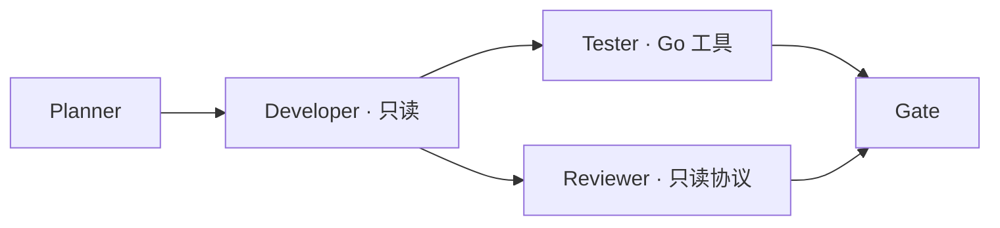

# P1-04a：只读角色与交接协议（已实现）

这是四角色的运行机制验收，不是四个真实 LLM 的自动修复能力。Planner、Developer、Reviewer 使用 scripted 输出，只读；Tester 使用原 AgentLoop 调用真实 Go 工具。真实 ChatProvider 在该图创建前明确拒绝，不会静默降级。

## 图与权限



当前仍串行调度。Node 新增 role，旧图缺省为 verifier；operation 继续表示 Go 操作，不能用它冒充角色。新模板在 workflow.py，CLI 和 Web 复用。

| 角色 | 可输出 | 可执行工具 | 交接材料 |
|---|---|---|---|
| Planner | role_result | 无 | 当前快照、需求、角色材料 |
| Developer | role_result，不接受 patch | 无 | Planner 有界摘要与证据引用 |
| Tester | 既有 tool_call / final | 本节点所选 Go 操作 | Developer 有界摘要；final 必须有真实工具结果 |
| Reviewer | role_result | 无 | Developer 结果的来源引用；不含作者摘要或 Tester 结果 |

Reviewer 这轮只证明隔离输入机制可执行，未进行独立语义审查。

## 输出和来源约束

只读输出的精确字段：`type=role_result, run_id, role, snapshot_id, summary, evidence_refs, decision`。身份必须匹配本次 run、角色、当前快照；summary 非空且不超过 4,000 UTF-8 bytes；decision 只能 ready 或 blocked。blocked 阻止后继执行并使 Gate 不通过。

本切片 evidence_refs 只接受当前 run 的 manifest_ref，读取时仍校验 artifact 哈希。此引用证明绑定哪个快照，不证明摘要内容正确。符号级 Claim/Evidence 与 plan/patch/review 的具体结构属于下一阶段，不能把当前通用 envelope 当成完整角色语义契约。

角色输出在落盘前校验；只读角色不能借共用 loop 请求工具、shell 或补丁。全部角色共享 model_calls、tool_calls 和 deadline，不单独刷新预算。

## 交接、恢复与 Gate

`collaboration.receive_handoffs` 只沿声明的直接依赖投递；发送者必须是已成功完成的只读角色，且结果 ready。收件人身份、来源结果、快照与角色契约重新核对。消息标记 unverified_role_claim，不晋升为 Memory fact。

SQLite 新增 handoff_receipts：唯一键为 run_id、sender、receiver、graph_version、snapshot_id；保存不可变消息 artifact_ref。同一事务写 receipt 和 handoff_received 事件；重复收件内容一致则复用，不重复事件，不一致则报冲突。事件写入失败会一起回滚，可能遗留未引用的内容寻址 artifact，不会生成已收件事实。

收件后、模型前中断可以恢复：收件去重，但不承诺模型请求 exactly-once；已发出模型请求的预算不退还。当前测试用重开 SQLite 和未完成 attempt 模拟此边界，不声称本轮做了 OS 进程强杀。

交接总内容最多 16,000 bytes。使用 ContextBuilder 时，交接和角色权限先加入必需部分，再参与整体字节预算；超限拒绝，不能在裁剪后追加。context_built 和 model_requested 引用的是同一实际输入。

Gate 不只看 succeeded：只读角色再次校验输出与 receipt；Tester/verifier 仍重新读取工具账本和当前快照。缺少 receipt、内容冲突、过期证据均不能成功。只读图至少包含一个真实工具验证节点。

## 使用

```powershell
.venv\Scripts\python.exe -m masa run --repo tests/fixtures/go-complex --collaboration --model-calls 6 --tool-calls 3 --intelligence
```

前端新建任务选择 Scripted，勾选「四角色只读协议演示」。它与完整验证图互斥。旧服务没有新能力标记时入口禁用，需先重启后端；原内存密钥随重启丢失。图节点显示角色，时间线可查看 handoff_received 引用，报告列出交接 artifact。现有真实单验证 / 完整验证功能仍保留。
