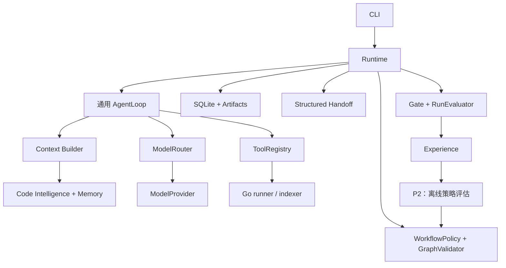

# MASA Runtime 架构总纲

v0.3 / 2026-09-26。本文定义整体设计；P0 框架开始落地，P1/P2 能力尚未实现。实际范围见 [P0 使用说明](USER_P0_QUICKSTART.md) 与 STATUS_PROJECT；实施入口为 [LLM_IMPLEMENTATION_GUIDE](LLM_IMPLEMENTATION_GUIDE.md)，优先级为 [PLAN_PRIORITY_ROADMAP](PLAN_PRIORITY_ROADMAP.md)。

## 1. 最小工程形态

一个 Python 应用负责 runtime、graph、agent loop、代码检索、上下文与持久化；一个 Go 二进制负责受控工具执行与 AST 索引；一份 SQLite 加本地 artifact 目录。CLI 先行，不引入 Web、Redis、消息队列或 gRPC。



P0 只有一份默认 policy 和模型配置；尚无实现的模块不建空服务。Graph 和版本字段先稳定，优化策略以后替换普通函数即可。

## 2. 最少代码布局（未来逐步创建）

```text
src/masa/
  cli.py                 # 入口与装配
  domain.py              # Run、Step、Attempt、GraphSpec、Evidence 等
  runtime.py             # 调度、预算、恢复、终态
  workflow.py            # graph 校验与默认模板；后加受约束 patch
  agent.py               # 通用 loop 与角色配置
  tools.py               # registry、授权、路径、文件/Git 操作
  context.py             # 上下文选择与 manifest
  intelligence.py        # 索引查询与影响证据
  memory.py              # 有效性与失效
  policies.py            # 简单策略与模型路由；P2 再扩展
  adapters/
    sqlite.py
    model.py
    runner.py
runner/
  go.mod
  cmd/masa-runner/main.go
  internal/runner/
  internal/indexer/      # P1 才增加
tests/
examples/go-todo/
evals/                  # harness；私有验收数据不得放入 agent 可读副本
docs/
.masa/                  # 被忽略的 run DB、工作区、artifact
```

只在真正跨系统边界使用接口：ModelProvider、ToolExecutor、RunStore。workflow/context/retrieval 策略先用函数与数据对象，出现第二实现才提取合适抽象。文件过长再按职责拆包，不为每个英文名称创建目录。

## 3. 核心数据与版本

| 对象 | 责任 |
|---|---|
| Run | 用户目标、Task Contract、预算、当前图/策略版本和终态 |
| GraphSpec/GraphVersion | 声明式节点、边、输出契约与变更历史 |
| Step/Attempt | 节点逻辑状态与具体尝试；重试追加记录 |
| ToolCall | intent/result、请求哈希、状态、产物与不确定副作用 |
| WorkspaceSnapshot | 工作区文件清单、内容身份与 build profile |
| EvidenceRef/Artifact | 可追溯证据与不可变大内容 |
| Event | 追加时间线，不承诺完整 event sourcing |
| MemoryRecord/ContextManifest | 当前材料有效性与每次实际输入 |
| Message/Receipt | 结构化交接与幂等消费 |
| Experience/PolicyBundle | 运行经验与版本化策略；按阶段引入 |

snapshot 表示文件内容，build_profile 表示构建条件，graph_version 表示执行路径，policy_version 表示选择规则，prompt/model 配置另留 hash。这些不能共用一个含糊的 version 字段。

## 4. 状态与执行循环

Run：created→running→succeeded/failed/cancelled/needs_attention；显式 pause 使用 running→paused→running。

Step：pending→ready→running→succeeded/failed/cancelled/interrupted；未执行的可选节点可 skipped。新 attempt 记录重试，旧失败保留。逻辑状态转换由 runtime 控制，LLM 返回完成文本不能直接更新终态。

```text
读取 run 和当前已提交图
核对取消、deadline、全局预算
选择依赖满足且资源约束允许的节点
持久化 attempt_started
若 agent 节点：构建上下文 → 路由模型 → tool loop / 结构输出
若 tool 节点：执行已注册工具
若 gate 节点：汇聚所有必要终态与证据
保存产物、状态和事件
必要时生成并校验 GraphPatch；否则推进或结束
```

单 runtime owner 先行。P0 串行调度并且只执行验证；P1 再支持同 run 两个只读验证步骤并发和单写约束。Gate 等所有必要检查终态，不因一条失败让其它结果丢失。修复创建新节点与新 Attempt，不构造无限环。

## 5. 不可被优化器修改的不变量

1. 用户 Task Contract、权限与验收条件不可被策略自行放宽。
2. 每条决策证据必须知道对应 snapshot/profile；过期事实不能支持当前成功判定。
3. 检查和 Review 针对同一冻结版本；并行验证期间没有代码写入。
4. Gate 依据真实退出码、当前 findings 和验收条件决定 run 是否完成；独立评估不与自报成功混淆。
5. 重规划、模型升级和工具重试累计消耗同一个全局预算。
6. 运行历史不可被删除以隐藏失败；策略回退不修改旧 run。
7. 用户源仓库不被静默覆盖、reset 或提交；产物来自运行副本。
8. 任意模型输出都不直接成为 shell 命令、Python 可执行代码或授权。

## 6. 角色、图和交接

Planner 负责计划与图提案，Developer 写实现，Tester 写测试，Reviewer 只读审查，GoCheck 是确定性工具节点，Gate 是 runtime 规则。复用一个 AgentLoop；新角色不等于新服务。

P0 用 template policy 产生最小图；P1 支持 standard_fix/inspect_first/format_only 和有界修复；P2 让经过评估的经验影响策略选择。具体 GraphPatch 与消息图版本约束见 [优化设计](DESIGN_ADAPTIVE_OPTIMIZATION.md)。

Handoff 是“改动、证据、未验证项、下一步”的结构化 artifact。P1 发送完整有界交接，接收方通过 Context Builder 展开必要证据；P2 再做 delta cursor。固定角色名不意味着固定执行路径。

## 7. 工具与 Go 边界

Python 管理读取/搜索、补丁、Git 和策略检查；Go 管命令生命周期以及 Go AST 事实提取。跨语言使用带 protocol_version/request_id 的 stdio JSON 请求响应；每次受控调用一个子进程，避免先维护常驻服务。

初始 operation：go_test、go_vet、go_fmt_check；P1 添加 go_index 与独占写入的 gofmt。输出区分 completed+非零退出、timeout、cancelled、rejected、internal_error。诊断写 stderr，stdout 保持协议。大输出有界并继续 drain，避免阻塞。

命令与参数白名单，模型不能注入 Go flags；可信启动参数决定工作区，防止路径/junction 越界；子进程环境不携带模型密钥。Windows 取消必须处理进程树，只杀父进程不能通过完整 runner 验收。

Go 的功能重点是标准库进程管理和 AST；类型增强以后增加。runner 是可信本地仓库的受控执行器，go test 会执行仓库代码；不宣称容器级安全沙箱，P3 才考虑不可信仓库隔离。

## 8. 持久化与恢复

P1-01 落地补充：`patching.Patches` 在 runtime owner lock 下校验整份补丁，先持久化 intent，再逐文件原子替换，最后在一个 SQLite 事务中提交新快照、结果引用和事件。暂存文件放在工作区外，避免中断遗留文件污染快照。恢复先核对整个工作区，只有文件内容等于前像或后像时才补写；第三种内容进入 needs_attention。恢复完成后才校验工具快照。

当前补丁只允许 created 且没有 attempt 的 run，每 run 一份、仅已有 Go 实现文件，全文件 UTF-8 替换；不写测试、模块配置，不创建或删除文件。补丁消耗一次全局工具预算，恢复不再次扣费。旧结果不会因写入被重置或迁移为新版本成功。P1-04/P1-05 再接入执行图内 Developer 写入和新验证节点。

SQLite 在既有 schema v1 上以 `CREATE TABLE IF NOT EXISTS patches` 添加可选账本表，不改变旧行布局；原有运行无需重写即可读取。长期多版本迁移在后续字段变更时再引入显式迁移。

SQLite 短事务提交状态、事件和版本比较更新；模型调用和工具运行不占数据库事务。artifact 临时写入后原子 rename，再提交引用。

工具 intent→执行→结果落盘→状态提交。崩溃可能发生在副作用之后、记账之前，因此只承诺可核对恢复，不承诺 exactly-once。文件补丁持有每文件前后哈希；多文件部分写入按清单恢复；哈希与前后都不一致时 needs_attention。

恢复先确认旧进程终止与工作区一致，再读取当前图、消息 receipt 和上下文引用。只读检索可重试，未知写操作不可盲重放；索引是缓存，可重建，memory 决策和事件不是缓存。

测试成功记录还绑定实际命令、工具链和环境。全量 GoCheck 不因图优化被省略；类型/影响图不完备时更不能只运行部分测试后宣布完整成功。

## 9. 可扩展点与明确后置项

先验证 Python 控制面与 Go 工具面，后续根据真实需求替换 ToolExecutor 为容器或远程 worker，RunStore 为多用户存储，ModelProvider 为其他 API。需要网络部署时再加 HTTP 入口，不改变领域模型。

暂不加入：登录模块、微服务、Go runtime 重写、向量数据库、完整调用图、自治 agent 群聊、模型训练、在线策略探索。详见路线中的 P2/P3；后置不代表永不做。

## 10. 详细资料

- [代码、记忆和上下文机制](DESIGN_INTELLIGENCE_CONTEXT.md)
- [图、经验、路由和自优化机制](DESIGN_ADAPTIVE_OPTIMIZATION.md)
- [优先级与各阶段完成标准](PLAN_PRIORITY_ROADMAP.md)

本总纲与专项文档定义未来实现契约；状态文件和实际检查结果才定义当前已完成能力。
