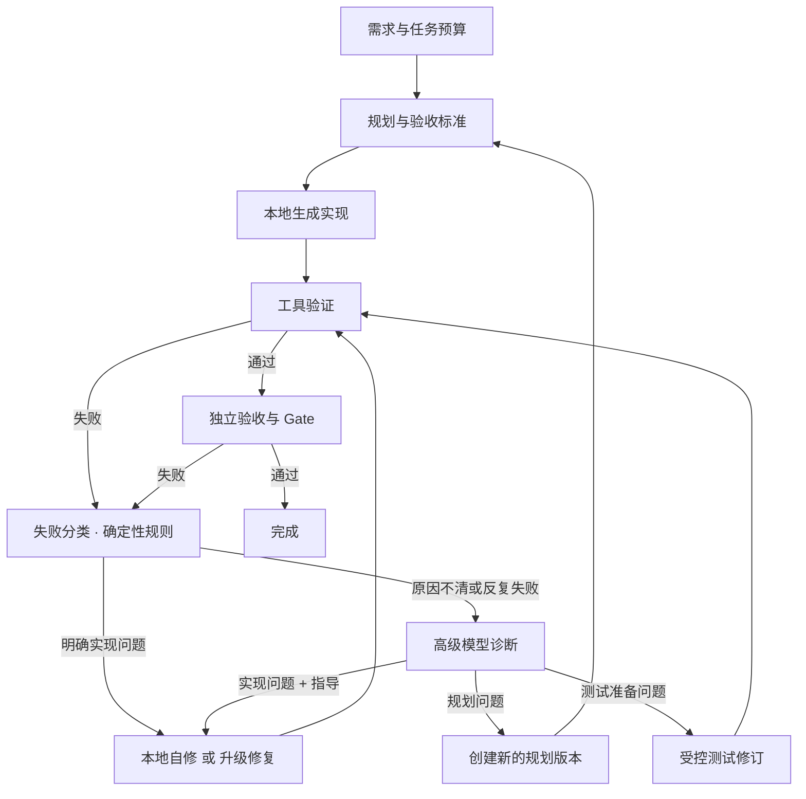

# 多模型 · 长时间运行 · 动态角色：Runtime v2 方案

2026-10-03。分支 `feature/multi-model`。**覆盖** [PLAN_MULTI_MODEL](PLAN_MULTI_MODEL.md) 中“不增加任意动态图、并发 Agent”的约束（用户明确要求动态角色与图）；R0–R5 的阶段编号保留并映射到本文路线。其余证据、冻结测试、Gate 独立核对、未知请求保护等原则**不变**。

## 状态（2026-10-03）

| 里程碑 | 状态 |
|---|---|
| **M0 预算与路由** | **已实现**并已用真实 GLM→DeepSeek 验证升级阶梯，详见 [进展008](progress/PROGRESS_2026-10-03_008_m0-routing-and-budget.md)、[进展009](progress/PROGRESS_2026-10-04_001_m05-context-guard-and-recovery-drill.md) |
| **M0.5（进行中）** | 已完成：硬上下文拦截、崩溃恢复演练、真实升级验证（共修 4 个缺陷）。剩余：同级轮换、按角色起始等级、预算条/可编辑预算、估算在线校准 |
| M1 图与诊断 | 未开始 |
| M2 流式与动态角色 | 未开始；**已放行 `httpx`** |
| M3 质量与评测 | 未开始 |

已确认的决策：放行 `httpx`；引擎迁移采用 Strangler（保留 `go-cli-v1`，新引擎先接管失败后的修复子图）；Worker 只需“手动启动、崩溃可续跑”（不做开机自启/服务托管）。

## 0. 一句话

**不推倒重来，也不引入重型编排框架。** 现有的“事件账本 + 内容寻址产物 + 幂等调用账本 + 独立 Gate”已经是一个事件溯源的持久执行内核；缺的是三件事：**任务级预算与路由策略**、**把写死的线性 Coordinator 变成声明式图 + 通用引擎**、**把执行从 API 进程拆成可自动恢复的 worker**。按这个顺序做。

## 1. 目标形态（对应你的图）



关键设计判断：**图的边由确定性代码判定，模型只产出结构化“判断”，不直接决定走向。** 高级模型诊断输出 `{class, rationale, instructions}`，由路由器按预算与规则决定去哪条边。这样“动态”但仍可审计、可复现、可限界。

### 图上每个节点的现状

| 节点 | 现状 | 缺口 |
|---|---|---|
| 需求与任务预算 | 澄清、单 run 的 `Budget`（调用次数/期限） | **没有任务级预算**（跨规划/生成/修复累计 token、费用、时间、升级次数） |
| 规划与验收标准 | 已有：Planner + Tester + 契约校验 + 带原因重试 + 测试评审 | 验收标准未与测试做可追溯映射 |
| 本地生成实现 | 已有：逐文件 files-v1、gofmt 规范化、预检 | 上下文准入（输入 token 估算）未做 |
| 工具验证 / Gate | 已有：Go runner 隔离副本 + 独立 Gate | 仅 Go；无并行检查 |
| 失败分类 | 已有规则：`check_policy`（测试准备错误、仅格式、重复断言） | 类别需扩成 `planning / test_setup / implementation / unknown` 并带“重复签名”历史 |
| 受控测试修订 | 已有：`revise_tests` + 规格仲裁 | — |
| 创建新的规划版本 | 已有雏形：`retry_of` 重规划（继承澄清） | 未作为一等边 |
| 本地自修或升级修复 | 单模型修复，最多 4 轮 | **无升级阶梯、无路由** |
| 高级模型诊断 | **没有** | 新角色 `Diagnoser`（见 §4） |

## 2. 长时间运行

### 2.1 已有可复用的基建（别重做）

| 基建 | 位置 | 对长任务的价值 |
|---|---|---|
| 事件账本（`events.seq` 自增）+ SQLite WAL | `infrastructure/store.py` | 事件溯源；`seq` 可直接当变更游标/SSE 游标 |
| 内容寻址不可变产物 | `store.put/read` | 证据永不被覆盖；断点就是引用 |
| 角色调用账本 `role_invocations` | `runtime/roles.py` | 已有“意图先落盘 → 调用 → 结果落盘”，已完成的调用恢复时直接复用；**未知结果拒绝静默重放** |
| 任务检查点 `workflow_jobs` + `WorkflowCheckpoint` | `infrastructure/jobs.py`、`application/workflow.py` | 阶段/轮次/重复断言跨重启保留 |
| 每次调用的路由快照 `route_ref` | `role_invocations` | 每次调用已记录实际模型与参数（只是还没有“多候选”） |
| 预算与期限（单 run） | `domain/models.Budget`、`engine` | 调用次数、工具次数、截止时间 |
| OS 级独占锁 | `infrastructure/locking.py` | 进程异常退出由 OS 释放锁 |
| 取消标志 + 迟到结果不覆盖 | `run.cancel_requested`、`planning.update` | 取消语义已正确 |
| Go runner 隔离 + Windows Job Object 约束 | `runner/` | 工具执行有进程级约束 |
| 用量/耗时/工具调用报告 | `application/usage.py` | 成本与耗时的唯一事实来源，可直接喂给路由和预算 |
| 诊断日志、硬件只读采集、Ollama 控制 | `infrastructure/diagnostics.py` 等 | 运维可观测的起点 |

### 2.2 要补的（按“长时间运行会怎么死”倒推）

| 故障 | 现在 | 机制 |
|---|---|---|
| 进程崩溃/断电 | 任务被标 `interrupted`，**人工点恢复** | **Worker 租约 + 心跳**：任务行带 `lease_owner/lease_until`；worker 每 N 秒续租；过期自动被别的 worker（或重启后的同一 worker）接管并按账本续跑 |
| API 进程即工作进程（单线程） | `Console.job_thread` 一次只跑一个 | **API 与 Worker 拆进程**：API 只写“命令表”（取消/暂停/回答/批准）和读投影；Worker 轮询命令表、领任务 |
| 模型调用卡死 | 非流式，只能等超时，取消无法打断请求 | **流式 + 可取消的异步 HTTP**（`httpx`/asyncio）；无 token 进展超过阈值 → 判定 stall，主动中止并按幂等类别处理 |
| 未知结果的请求怎么办 | 一律拒绝重放（对贵的云调用正确，对免费的本地调用过严） | **幂等类别**：`free_local`（崩溃后自动重试）/ `paid_cloud`（只在预算允许且标记 `replay_ok` 时重发，否则人工）/ `tool`（有副作用，按 attempt 账本恢复） |
| 费用失控 | 无 | **任务级预算账本**（§3.3）：预留-结算，恢复时重建余额 |
| 死循环/反复失败 | 同一断言 3 次停 | **失败签名历史**：`(class, normalized diagnostics)` 重复 → 升级或停；总升级次数、总轮次上限 |
| GPU 显存/并发 | 靠用户不并发 | **资源信号量**：`gpu:1`、`api:N`、`runner:M`；模型切换成本（Ollama 加载）计入调度 |
| 上下文溢出 | 无准入 | 调用前**上下文准入**（估算 token + 输出预留）；超限先裁剪可裁剪证据，仍超限则换更大上下文的候选 |
| 磁盘增长 | 无清理 | 工作区/产物**保留策略**：失败证据永久保留引用，中间产物按任务结束后 N 天 GC（引用计数） |
| 无人值守 | 手动启动 | Windows 计划任务/服务托管 worker；崩溃自动拉起；健康检查端点 |
| 人在回路等待很久 | 期限 86400 秒/run | **等待态不计入预算时钟**；任务有“生命期”而不是单 run 期限 |

**租约表示例**（SQLite 即可，不需要消息队列）：

```
tasks(id, root_run_id, status, lease_owner, lease_until, budget_ref, policy_ref, created, updated)
commands(id, task_id, kind, payload_ref, created, handled_at)     -- API 写，worker 读
```

## 3. 多模型

### 3.1 抽象

- **Model Registry**：沿用 Settings profiles（`level/priority/roles/context_limit/timeout/price`），补充 `capabilities`（结构化输出可靠度、支持 thinking、最大输出）与 **digest**（本地权重摘要，恢复时校验）。
- **Route Policy（纯函数）**：`route(role, attempt_history, failure_class, budget, candidates) -> Candidate | Stop(reason)`。无副作用、无网络、可单测、结果写入每次调用的 `route_ref`（现已具备按调用记录的位置）。
- **从“任务固定单模型”改为“任务固定*策略*，调用选择候选”**：把 `model_snapshot_ref`（mode=fixed）升级为 `routing_snapshot`（候选集合 + 策略版本 + 预算），仍不存密钥；恢复时用原快照，设置被改/删除则明确停止。
- 一次调用内模型不变（现有 `input or provider changed` 保护保留）；升级 = **新 invocation_id** + 新 attempt，旧调用完整保留。

### 3.2 默认策略：本地优先，有界升级

```
初次 → L1(本地) ──失败(契约/编译/断言)──► 同级自修 1 次
                                   └─仍失败 / 签名重复 / 分类=unknown ─► Diagnoser(高级)
Diagnoser 输出 class + instructions
   implementation → 本地带着 instructions 再修 1 次 → 仍失败 → 高级模型直接修
   test_setup     → 受控测试修订（测试作者优先用与实现作者不同的模型）
   planning       → 新规划版本（高级模型重规划，继承澄清与失败证据）
任一环节：预算耗尽 / 无更高等级 / 升级次数上限 → 停止并给出证据，不再烧钱
```

要点：
- **Diagnoser 先于高级“代写”**：诊断便宜（输入证据、输出短 JSON），让本地模型执行修复；只在诊断后仍失败才让高级模型直接写代码。这是“大部分工作由本地完成”的关键杠杆。
- 配置/鉴权/工具环境类失败**不**归因于模型弱，不触发升级；结果未知的请求不靠换模型掩盖。
- 路由要点按**角色**区分：Planner/Tester/Diagnoser 偏向高等级（输出短、影响大），Developer/Repair 偏本地。

### 3.3 任务级预算（R3，先于任何自动升级）

沿现有账本累计，不为子 run 重置：调用次数、墙钟、云 token、可选费用、升级次数。**预留-结算**：请求前按“输入估算 + 输出上限”预留，响应后按真实用量结算；缺用量记“未知”而非 0（与报告一致）；未知结果的请求仍占预留。恢复时由事件重建余额。预算超限是路由器的 `Stop`，不是异常。

### 3.4 本地模型的现实约束

上下文准入、digest 校验、`keep_alive` 与显存调度、结构化输出（Ollama `format` JSON schema）失败率按模型统计。**每模型每角色首轮通过率/契约拒绝率**从事件投影（已有数据），作为路由的软信号（只调整同级优先级，不越过用户设定的等级）。

## 4. 动态角色与 A2A

### 4.1 区分两件事

| | 含义 | 建议 |
|---|---|---|
| **内部多 Agent 协作** | 角色之间交接工作 | **现在做**：编排式，不是自由对话 |
| **外部 A2A / MCP 协议** | 与别的 Agent/工具生态互联 | **后做**，作为适配器；内部词汇先对齐 |

### 4.2 内部：类型化产物 + 确定性编排（黑板模式）

- **角色 = `RoleSpec`**：`name`、输入/输出 schema、允许的工具（默认无）、上下文配方（取哪些产物、预算多大）、提示词模板版本、校验器、默认模型层级。角色是**数据**，注册在 Role Registry，不是代码里的 if。
- **交接 = 新产物 + 一条事件**，不是消息聊天。下游节点读上游产物引用（现有 `handoffs.py` 的“交接材料、不授予写权限”思想保留）。
- **编排器是确定性的**；角色只“提议”。这与既有约定一致：*角色负责决策，检查节点负责动作；Runtime 校验计划与工具请求；Gate 独立核对真实结果*。
- **动态但有界**：允许 Planner/Diagnoser 提议**子图**（例如“拆成三个包并行生成”“增加一次安全评审”），但只能从**白名单节点模板**组合，并经 Runtime 校验：节点数上限、不得新增工具权限、不得绕过 Gate、总预算不变。校验失败 → 拒绝提议，使用默认图。
- **并行**：图允许时（多文件生成、独立评审）由调度器按资源信号量并行；Gate 前必须汇合。

### 4.3 对外 A2A / MCP（预留，不做）

内部实体命名对齐通用词汇（`Task`、`Message`、`Artifact`、`AgentCard`），将来把整个系统暴露为 A2A 服务，或把 runner 的白名单工具暴露为 MCP 工具，只是一个薄适配层。**不要现在为了协议引入依赖。**

## 5. 输出质量保障

分层防御，**越靠前越便宜**。原则不变：Gate 只认真实证据，不放松、不让模型自称通过。

| 层 | 已有 | 新增 |
|---|---|---|
| 契约 | 响应 schema 校验、路径/包/依赖预检、带原因重试 | 按模型统计拒绝率 → 路由信号 |
| 确定性修复 | gofmt 规范化、仅格式失败无模型修订 | `goimports` 类自动修未使用导入（先以只读诊断验证，避免改语义） |
| 测试质量 | 测试计划规则评审 + 语义评审（独立模型）+ 测试-规格仲裁 | **验收标准 ↔ 测试用例追溯矩阵**；覆盖缺口必须显式标注 |
| 测试有效性 | `mutation.py` 小规模变异评测（离线） | **变异门**：关键任务要求测试能杀死预置变异，否则测试不算数 |
| 独立性 | — | **测试作者 ≠ 实现作者**（不同模型/不同上下文），避免同源盲点 |
| 行为证据 | `run_application` 手动运行 | 规格内的**可执行样例**（输入→预期输出）由 runner 自动跑，进入 Gate 证据 |
| 工具 | `go test / vet / gofmt` | `go test -race`、覆盖率阈值（可配置） |
| 难点采样 | — | 高难节点 pass@k / 自一致性，**仅在预算允许时**启用 |
| 回归基线 | `docs/scenarios`、`scripts/accept_*` 手动 | **Benchmark 套件**：固定任务集 × 模型 × 策略，定期跑，产出每模型/角色的评分卡，**驱动路由而非人工感觉** |
| 人 | 逐步确认模式 | 可配置的人审关口（高风险、预算将尽、升级前） |

## 6. Runtime 设计

### 6.1 分层

```
Interfaces   HTTP API（读投影 + 写命令）· CLI · 将来 A2A/MCP 适配器
Application  Task Service · Workflow Engine · Router/Budget · Quality Gates
Domain       Task · Node · Edge · RoleSpec · Policy · Budget · Evidence · FailureClass
Runtime      Executors：Role / Tool / Human / Router    Resource Manager
Infra        SQLite 账本 + 内容寻址产物 · 模型传输(流式) · Go runner(+语言包) · 沙箱
```

### 6.2 声明式工作流 + 通用引擎

- 工作流 = 数据（JSON）：`nodes[{id,type,role|tool|policy,inputs,outputs}]`、`edges[{from,to,guard}]`。**§1 的图就是模板 `go-cli-v2`**。
- `guard` 是对 `(outcome, failure_class, budget, history)` 的**纯函数**，注册制，可单测。
- 引擎（泛化现有 `runtime/engine.py` 中已有的“按依赖调度 + attempt 先落盘 + 恢复”）：
  1. 取就绪节点 → 2. 申请资源 → 3. **先写 node_run 意图** → 4. 执行 → 5. 写结果与产物 → 6. 评估出边 → 7. 写迁移事件。
  任一步崩溃，由账本推断下一步；节点执行必须幂等或可由账本判定。
- **策略迁移（Strangler）**：保留现有 `WorkflowCoordinator` 作为 `go-cli-v1` 的实现；新引擎先只跑“失败后的修复子图”，通过回归基线后，再接管全流程。**不做一次性重写。**

### 6.3 进程与并发

- 进程：`API`（FastAPI 非必须，沿用标准库 server 也可）｜`Worker`（asyncio，持租约）｜`Go runner`｜模型端点。单机单用户先用 SQLite；多用户/多机再换 Postgres（账本抽象为 Repository，现已集中在 `Store`）。
- Worker 内 asyncio：模型调用可流式、可取消；工具调用经 runner（子进程）；资源信号量限流。
- **流式**：先落“真实阶段事件”（已有），再加只读 token 预览；预览内容**不可批准、不可发布**；落盘按块合并，避免事件表爆炸；断线不重复调用模型。
- **取消**：取消标志（现有）+ 中止进行中的流式请求；已收到的响应仍保留为证据但不应用（现有语义）。

### 6.4 上下文与记忆

- `ContextBuilder`（现有）按 `RoleSpec` 的“上下文配方”取材并裁剪；批准的规格与冻结测试**不可被裁掉**。
- 长任务：失败历史压缩成“修复日志”（已有 `repair_context`）；仓库索引扩展到多包 Go（符号级），再抽象为语言包接口。
- 证据记忆（现有 `memories`）按 run 隔离、保守失效，继续保持。

### 6.5 超出 Go

引入 **Language Pack**：`{toolchain manifest, 白名单操作(build/test/lint/fmt), 项目模板, 预检规则, 提示词片段}`。runner 协议保留，新增操作走白名单；沙箱先用隔离副本 + 进程约束，容器（Docker/Windows Sandbox）作为可选后端。

## 7. 技术选型（建议）

| 需求 | 建议 | 理由 / 备选 |
|---|---|---|
| 持久执行 | **自研：SQLite 事件账本 + 租约** | 已有且是项目差异化（证据可追溯）。*备选*：Temporal（强但需服务端，Windows 单用户过重）；LangGraph（有 checkpointer，但会与现有账本/证据模型重复，且被其状态模型绑定） |
| 并发/取消/流式 | **`asyncio` + `httpx`** | 取代 `urllib` 阻塞调用，才能真取消与流式；这是唯一建议新增的运行时依赖 |
| 契约/Schema | 先沿用手写校验；Role 数量变多后引入 **`pydantic` v2** | 动态角色需要可序列化的 schema；到时再引，不提前 |
| 工作流定义 | **JSON + 注册制 guard 函数** | 可版本化、可存快照、可单测；不用 YAML DSL |
| 传输到前端 | **SSE**（`events.seq` 当游标） | 单向足够；前端 `refetchInterval` 已留替换点 |
| 进程托管 | Windows 计划任务/服务 + 健康检查 | 先简单，需要时再上 supervisor |
| 对外协议 | **后做**：A2A 适配器、MCP 工具适配器 | 内部词汇对齐即可 |
| 评测 | 自建 benchmark 套件 + 评分卡（SQLite 表） | 直接复用 usage 报告数据 |
| 本地模型服务 | 继续 Ollama；接口抽象后可接 llama.cpp server / vLLM | 传输层抽象，不绑定 |

依赖策略建议：**核心保持近乎零依赖**（现为 `dependencies=[]`），仅放行 `httpx`（必要）与后续 `pydantic`（按需）。这一条需要你确认。

## 8. 路线（在 `feature/multi-model` 上，4 个里程碑）

| 里程碑 | 内容 | 验收（真实，不靠单测宣称） | 对应旧编号 |
|---|---|---|---|
| **M0 预算与路由** | 任务级预算账本；`RoutingSnapshot`；`route()` 纯函数；修复阶段的升级阶梯（本地自修 1 次 → 升级）；上下文准入；digest 校验 | 同一任务：本地先试、重复失败后升级到 API；预算耗尽停止；恢复/改配置不隐式换模型；报告显示升级链与分模型用量 | R1 + R3 + R2 |
| **M1 图与诊断** | 声明式工作流 + 通用引擎（先接管失败后子图）；`Diagnoser` 角色 + 失败分类扩展 + 签名历史；API/Worker 拆分、租约、命令表、自动续跑 | 杀掉 worker 进程后任务自动续跑且不重复付费；§1 图中的所有边都有真实任务走过的证据 | R4（改为 Diagnoser）+ 长任务基建 |
| **M2 流式与动态角色** | 异步传输 + 流式 + 真取消；资源信号量；`RoleSpec` 注册表；受限子图提议；并行生成 | 取消能在请求中途生效；无 token 进展 stall 被识别；并行生成不爆显存 | — |
| **M3 质量与评测** | 追溯矩阵、变异门、测试/实现跨模型、可执行样例、benchmark 套件与评分卡、评分卡驱动同级优先级 | 固定任务集上：固定 API / 本地优先 / 带诊断 三种策略的通过率、token、耗时对照 | R5 |
| 之后 | 语言包（非 Go）、A2A/MCP 适配、容器沙箱 | — | — |

建议先做 **M0**：它最小、能立刻体现“大部分本地、疑难升级”的价值，并且为 M1 的路由/预算打好地基。每个里程碑独立验证、提交、更新 CURRENT。

## 9. 需要你确认的三点

1. **依赖策略**：是否放行 `httpx`（M2 必需；M0/M1 不需要）？
2. **引擎迁移**：同意 Strangler（保留 `go-cli-v1`，新引擎先接管失败后子图）而非一次性重写？
3. **Worker 托管**：目标是“长期开机自动运行”（Windows 计划任务/服务）还是“手动启动、崩溃可续跑”？这决定 M1 的运维部分做多深。
