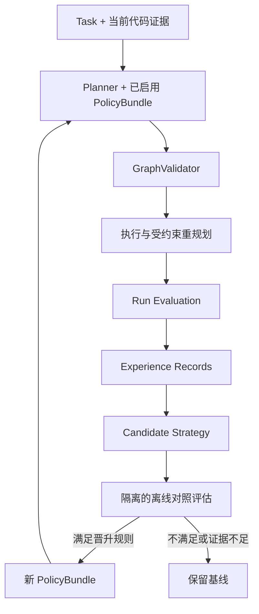

# MASA：自适应执行与经验驱动优化

版本 v0.3，2026-09-26。设计已纳入路线，功能未实现。范围与优先级以 [实施路线](../../PLAN_PRIORITY_ROADMAP.md) 为准。本文件补充已有代码证据、记忆与协作设计，不另造一套 runtime。

## 1. 对四个方向的结论

| 方向 | 结论 | 第一版做什么 | 暂不做什么 |
|---|---|---|---|
| Adaptive Graph Workflow | 采纳，但有约束 | GraphSpec 执行内核；按任务选模板；按证据补节点、修复与重规划 | 任意生成可执行代码图、运行中重写已执行历史、追求全局最优 |
| Experience Memory | 采纳，先记录后复用 | 每个 run 形成可追溯 Experience；成功、失败、取消均保留 | 一次成功就自动认定通用策略 |
| Model Router | 采纳接口，分阶段增加能力 | 单模型默认策略；以后用能力/风险/预算规则路由 | 初期训练路由模型、按角色名直接断定模型档位 |
| Self-Optimization Loop | 采纳为 P2 主线 | 候选策略→离线对照→版本晋升→回退 | 在线随意试错、自动改权限/验收/自身源码 |

用户提出的“不要固定流程”落实为：runtime 从第一阶段执行数据化图而不是硬编码角色串联；初期模板是可靠的初始图来源。之后扩展图生成策略，不重写执行核心。

## 2. 名称与能力级别

MASA 的目标全称可以采用 **Evidence-driven Self-Optimizing Software Engineering Agent Runtime**，表达证据驱动、任务执行与经验改进三层。为避免名字先于实现，报告使用阶段限定：

- P0：Agent Runtime Skeleton，能执行和追踪图。
- P1：Evidence-driven Adaptive Runtime，具备受约束适应、代码证据与协作闭环。
- P2：Experience-guided Optimization，能够提出、评估和采用策略变体；满足改进证据后描述为 self-optimizing。

Self-optimization 指编排、检索、上下文和模型选择策略改进；不指训练基础模型，也不指 agent 修改 runtime 源码。自我反思文本、单次修复和手动改配置本身都不足以证明自优化效果。

## 3. Adaptive Graph：图是运行数据，策略负责提案

### 3.1 GraphSpec 与图版本

GraphSpec：`graph_id, run_id, version, parent_version, task_contract_version, policy_bundle_version, nodes, edges, output_contracts, change_reason, source_evidence_refs, created_at`。

NodeSpec：`node_id, type, role, input_refs, output_schema, workspace_access, dependencies, model_profile, budget_cap, required_checks`。type 限定 agent/tool/gate；role 和工具只能从注册表选择。Planner 输出声明式 proposal，不能填 shell、任意 Python 表达式或新的工具权限。

Edge 声明触发条件 `all_succeeded` 或 `all_terminal`。普通执行步骤使用前者；聚合检查结果的 Gate 使用后者。条件是有限枚举，不能运行模型生成的判断代码。

持久化图规范与节点运行状态分开：旧 graph_version 不可修改；节点已执行的 Attempt 和产物永久保留。新增版本通过 stable node_id 复用输入契约未变的已完成节点；有输入变更的节点生成新 ID，并通过 `supersedes_node_id` 关联。不能把旧成功状态直接复制到新输入。

### 3.2 允许的初始策略

P0 仅 standard 模板，仍使用 GraphSpec 与通用调度。P1 加入三个有限策略：

| 策略 | 适用条件 | 初始图 | 不可省略的验证 |
|---|---|---|---|
| standard_fix | 普通小型 Go 缺陷 | Plan→Develop→TestDesign→Check 与 Review→Gate | 当前快照完整测试、格式、vet、阻断 findings |
| inspect_first | 定位不清、跨包候选、解析有盲区 | Retrieve/Map→Plan→standard_fix 后续 | 同上，补证不能代替最终验证 |
| format_only | 用户明确仅格式化且变更受限 | FormatTool→DiffScopeCheck→GoCheck→Gate | 修改范围与格式检查、Go 回归验证 |

纯格式化交给 gofmt，不调用小模型“做格式化”。无法确定是 format_only 时回到 standard_fix。代码修改默认保留测试设计和独立审查，后续若要跳过角色，必须有明确策略适用条件和独立评估。

### 3.3 受约束重规划

运行时只能在步骤/工具安全边界应用 GraphPatch。触发包括：缺少定位证据、发现额外调用方、测试失败、模型能力不足、任务内出现新的约束证据。发现用户未授权的新需求时先 needs_attention，不自动扩大目标。

GraphPatch：`patch_id, expected_graph_version, expected_run_version, operations[], reason, evidence_refs, budget_estimate`。

允许动作：插入只读补证节点、拆分尚未开始的开发步骤、追加新修复轮、替换尚未执行的可选节点、调整不破坏依赖的只读并行关系、为新 Attempt 更换已允许模型配置。移除节点指将未运行可选节点标为 skipped 并保存理由，不抹掉历史。

禁止动作：删除最终 Gate、削弱验收、改变写权限、删除已有失败证据、重新解释已经执行的节点、把失败检查当作成功依赖、突破全局预算。执行中的节点不能被直接换输入或删除；先取消并确认副作用停止，再规划后续。

### 3.4 GraphValidator 与事务应用

顺序：schema → 节点类型/角色/工具白名单 → 无环性 → 输出输入契约 → 必需检查可达性 → 单写与同快照检查 → 成本/数量上限 →版本比较更新。

事务提交新图版本、跳过/新增节点记录和 graph_replanned 事件；使用 expected_run_version 防止过期提案覆盖刚完成的步骤。失败就拒绝 patch，保持旧图；不是半应用。当前版本本身已无法推进时，明确 failed/needs_attention，而不是卡在 ready。

循环通过追加有限修复节点表达，图本身仍无环。建议初始上限：每 run 24 个总节点、2 次修复、3 次 GraphPatch、每 step 2 次额外补证、只读并发 2。预算覆盖所有图版本与已删除/跳过前发生的成本，不因换图清零。数值仅是默认设计参数。

### 3.5 重规划后的上下文与通信

MessageEnvelope 增加 `graph_version, recipient_node_id`。向旧图可选节点发送但尚未消费的消息，不能直接投递给名称相同的新节点；由 router 核对输入契约后重新建立 delivery，保留原消息。

GraphPatch 若仅插入补证，不使无关源码失效；若改变 Task Contract、目标 snapshot 或策略上下文，相关 ContextManifest 必须重建。新节点必须重新实体化必要上下文，不能假设被替换节点的模型对话可继承。

断点恢复先核对工具副作用，再读取唯一已提交的图版本；未提交 proposal 只作为草稿，不能恢复时再应用一次。GraphPatch 具有唯一 ID，重复提交返回原结果。

## 4. Graph Evaluator：执行前校验，执行后评估

一个未运行的新图没有真实成功率。执行前只能使用硬约束、结构特征和历史估计，必须区分 predicted 与 measured。

三个角色分开：GraphValidator 验证能否运行；RunEvaluator 记录这次结果；PolicyEvaluator 比较多次运行，决定候选策略是否可替代基线。它们首先是确定性函数，不另设三个 LLM agent。

RunEvaluation 包含：`task_family, graph_versions, policy_version, completion_status, gate_result, external_eval_result, verified_revision, input_output_tokens, model_cost, tool_cost, wall_time, critical_path_time, node_count, llm_call_count, replan_count, failure_category, unknown_metrics`。

目标采用“先满足质量与边界，再比较成本”：独立验收通过、必要检查完整、无权限/版本违规是硬约束；可行策略中比较总费用和墙钟时间，并列时偏好更简单的图。Agent 数量只作为复杂度指标，不单独奖励“越少越好”。

禁止用一个低成本加权分抵消错误修复。需要展示标量分时必须先过质量门槛，公开权重、归一化方式与样本量；初版保留多指标表和 Pareto 候选即可。取消和环境故障单独标记，不能从分母中悄悄删除。

## 5. Experience Memory：事实记录与学到的策略分开

### 5.1 ExperienceRecord

每次 run 终止后生成：

```text
ExperienceRecord
  id, schema_version, run_id, repo_id, task_family, task_fingerprint
  task_summary, constraints, initial_snapshot, final_snapshot, build_profile
  graph_version_refs[], agent_action_refs[], tool_call_refs[], artifact_refs[]
  model_config_refs[], context_policy_version, selected_experience_ids[]
  result: succeeded/failed/cancelled/needs_attention
  verification_level, gate_result, failure_category, metrics, unknown_metrics
  strategy_candidates[], provenance, applicability, created_at
```

大日志引用已有 artifact，不再复制全量聊天。成功和失败同样进入记录；不能只积累“成功经验”造成幸存者偏差。result 表示 runtime 终态，verification_level 区分工具检查、外部验收或未知。

Experience 是不可变的历史观察；LearnedStrategy 是从一个或多个 experience 提炼的候选决策规则。模型总结只产生 candidate，不具有自动执行权。

### 5.2 策略候选

StrategyCandidate：`id, parent_policy_version, conditions, proposed_change, supporting_experience_ids, counterexample_ids, expected_benefit, evaluation_plan, status`。

可提炼：“涉及共享分页 helper 的变更，先查另一入口契约，再修改”；不可提炼：“曾修好 page.go，因此今后直接复制这份 patch”或“为了省 tokens 取消审查”。策略只选允许的模板、检索规则、预算档位和模型档位。

一次经验无法证明因果收益。若缺对照，expected_benefit 标为 hypothesis；历史结果可以帮助提出候选，不能作为晋升的唯一证据。

### 5.3 检索与适用性

P1 只收集结构记录；P2 开始跨任务检索。先过滤语言、任务类别、工具能力、风险、策略状态与相容版本，再按关键词/结构特征检索，最多给 Planner 少量经验摘要与证据引用。

源码事实必须在当前 snapshot 重新核验；一般策略可以跨 snapshot 使用，但必须满足条件。例如“检查分页 helper 调用方”可能仍适用，“Normalize 在第 24 行”是旧源码事实，不能直接复用。

同一任务/近重复任务按 task_fingerprint 分组。测试集不进入经验库；最终评估保持 memory freeze 或明确的时间切分。少量人工种子经验允许做功能演示，但标注 seeded，不能声称系统自动学到了它。

### 5.4 晋升、反例与过期

candidate → evaluated → active / rejected；active → retired。保留 evaluation_refs 和替代原因。遇到反例先记录，达到策略回退条件时回到基线，不自动用另一个未经评估的候选顶替。

事实 memory 的 stale 由源码依赖变化触发；经验策略的 applicability 由语言/任务/版本/工具变化和反例触发。两者不要混成一个 TTL。不会过期的“永久最佳策略”不在设计中。

## 6. Model Router：先单模型，再规则，再评估改进

### 6.1 决策输入

RouteRequest：节点 role/type、任务范围、风险标签、代码/类型证据不足程度、近期失败类别、必要 schema/tool 能力、输入 token 估计、剩余总预算、deadline。

complexity/risk 是可解释特征，例如跨包、公共签名变化、缺失上下文，而不是模型一句“我觉得简单”。未知风险按保守档位；角色名只是一个输入，不是路由依据的全部。

ModelProfile 用 stable alias（default、economy、strong），配置实际 provider/model_id、能力、上下文限制、费用版本和超时。P0/P1 所有 alias 可指向同一已配置模型；没有第二个模型账户不阻塞项目。

### 6.2 规则与降级

1. tool-only 节点不经过 LLM，例如 gofmt、测试、AST 索引。
2. 按结构输出、tool calling、上下文和数据范围要求筛选合格模型。
3. 在合格模型中按允许规则选择档位，并记录选择理由和策略版本。
4. 结构化结果持续不合法或经验证属于能力不足时，可为新的 Attempt 升级一次；网络故障先走传输重试，不自动当能力不足。
5. 更换模型后用新 tokenizer/窗口重建 ContextManifest，预算累计；已执行工具不重放。
6. 无合格模型或预算不足时明确停止/needs_attention，不通过降级模型绕过要求。

Reviewer 不必永久指定“最贵模型”，simple coding 也不一定适合弱模型；是否节省由 end-to-end 成本决定，包括弱模型失败后升级的成本。

### 6.3 P2 验证

同一任务集比较全用默认模型、固定角色映射、按特征规则路由；冻结 workflow/context policy，记录选择、升级率、成功率、总 tokens/费用与延迟。价格和模型能力在实际接入时从 provider 配置核验，本文件不绑定当前价格或具体商品名。

训练路由器、bandit 和强化学习留为 P3，只有数据规模与任务收益足够时考虑。

## 7. Self-Optimization Loop：运行内适应 + 运行间改进



两个闭环不混淆：运行内因当前失败调整图，是 adaptation；运行间用评估改变未来规划策略，才是 optimization。两者都不要求基础模型权重变化。

### 7.1 PolicyBundle

版本化保存 `workflow_policy, retrieval_policy, context_policy, routing_policy, limits, baseline_version, evaluation_refs`。P0 只需一个本地配置版本与哈希；P2 才增加候选、评估和 active pointer。无需独立 policy 服务。

Run 创建时冻结 bundle。当前 run 的 graph patch 只能遵守其允许动作；新 policy 只影响新 run。回退 active pointer 不会把正在执行的 run 变成另一种策略。

### 7.2 候选产生与实验预算

候选提案可以由确定性规则或低频总结调用产生，输出受限 JSON 参数变更，不输出需要 exec 的优化器代码。单次只改变一个主要策略维度，避免无法归因。

设置独立 optimization_budget，候选数、总评估次数和模型开销受限。样本不足或预算耗尽就保留 baseline。不能为了“学到更好策略”占用用户正常 run 的剩余预算做隐形实验。

### 7.3 离线晋升规则

使用与训练/经验不同的验证任务，在独立工作副本对 baseline 和 candidate 做配对运行，保持模型/预算/工具配置可比。最低要求：硬约束违规为零、无已知必测用例回归、验收结果不劣且至少一个目标指标改善；小样本只能称“在本评估集内更优”。

起步时先 shadow 模式：生成建议和差异报告，不改变 active policy。只有完成晋升/回退故障测试且用户启用自动晋升配置后，按明确规则自动切换；这不是每次运行都询问授权，也不是本轮文档阶段启动自动优化。

训练集用于产生候选，验证集用于选择，最终报告测试集仅用于一次独立评估。不能把隐藏测试代码、gold patch 或逐案例答案放入 experience。外部评估层的结果以受控指标进入策略评估，不反馈答案给 coding agent。

### 7.4 何时可以声称 self-optimizing

能够展示：历史 run → 系统产生的候选 → 独立对照 → 实际采用的策略版本 → 新任务中采用理由 → 失败可回退。只有流程跑通但无效果改善时，称“实现自优化实验闭环，收益尚未证实”。这比写一个不可证实的“自主最优路径”更可靠。

## 8. 数据与恢复扩展

P0 增加 graph_versions 和 route_decision 日志（单模型也能记录）；P1 增加 Experience artifact；P2 根据查询需求才建 experiences/strategy_candidates/policy_evaluations 表。不一开始铺开全部 schema。

| 场景 | 处理 |
|---|---|
| GraphPatch 发布一半崩溃 | 事务未提交则继续旧版本；已提交按新版本恢复 |
| run 已终止但 Experience 未写完 | 以 run_id+schema_version 幂等重建观察部分，不重跑任务 |
| 候选评估中断 | 标 incomplete，已花成本保留，不满足晋升 |
| active policy 更新中断 | 指针与晋升事件同事务，恢复得到唯一版本 |
| 第二模型不可用 | 使用满足同等能力要求的允许 fallback；否则停止，保留预算记录 |
| 旧经验引用丢失 | 标 unavailable，不把无证据摘要用于决策 |

## 9. 与既有设计的关系

保留代码版本、证据校验、Context Builder、工具账本、单写约束和完整 Gate。将“固定流程”限定为最初的 template policy，不作为 runtime 的永久限制；将经验复用与通信 delta 从强制 demo 依赖降为 P2，以保证能先交付框架与闭环。

新增经验记录不替代原有 MemoryRecord；前者描述运行经验，后者描述当前决策材料。Model Router 不替代 ModelProvider；前者选择配置，后者执行模型调用。Graph Evaluator 不替代 Gate；前者比较策略，后者验证当前任务。

## 10. 参考与边界

[AFlow](https://arxiv.org/abs/2410.10762) 将工作流优化作为搜索问题，说明自动 workflow 优化可以作为研究方向；本项目不照搬其搜索规模与方法，采用更受控的模板和图变更。

[RouteLLM](https://arxiv.org/abs/2406.18665) 研究强弱模型间的路由，本项目先做规则和可替换接口，不将论文结果当作本项目节省成本的保证。

[Reflexion](https://arxiv.org/abs/2303.11366) 探索基于反馈的语言反思与经验，本设计进一步要求区分观察、候选策略与评估晋升。上述研究不使本项目自动具备同等效果。
