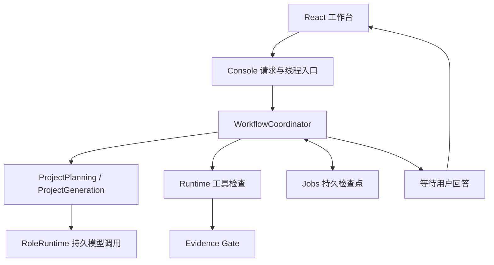

# Coordinator 与独立测试评审：职责、现状和路线

2026-10-02。

## 1. 为什么需要 Coordinator

当前工程有两类执行：Planner/Tester/Developer 进行模型调用，go test/go vet/格式检查进行真实工具调用。还有用户等待、方案批准、修复版本和服务重启。若这些分支全部塞进 Console，HTTP 接口会同时承担业务调度与线程控制，新角色每增加一次，都可能破坏恢复分支。

Coordinator 是应用层流程协调器，输入是一个持久 job、Store、Runner 和模型 provider。它读取当前检查点，然后调用现有规划/生成服务和 Runtime。它决定阶段转换，不代替模型思考业务方案，也不代替 Gate 判断代码通过。Console 接收请求、选择配置、启动线程和回报错误；Coordinator 负责推进；RoleRuntime 保存模型调用；Runtime 执行允许的检查；Gate核对工具证据。

## 2. 它实际管理什么

- 规划：调用 Planner，必要时暂停澄清，再调用 Tester。
- 批准/生成：自动模式按授权批准方案，生成独立代码草稿。
- 验证：把批准代码交给 Runtime；检查不通过则读取真实结果。
- 修复分类：测试准备错误交给测试修订；实现错误交给实现修复；纯格式问题走确定性格式化。
- 终止：预算/次数达到上限、相同断言停滞、结果未知等状态不继续盲目调用。
- 恢复：读取 plan_id/draft_id/run_id/attempt，复用已落盘输出和已验证版本。

本轮已将整个自动执行循环从 console.py 移到 application/orchestration/coordinator.py，并将错误分类函数移到 check_policy.py。workflow.py 保留阶段提交和停滞计数。现有 HTTP/API 不改，Coordinator 能在没有 Console 和 HTTP 的测试中独立运行。

这仍是有界串行工作流协调器。任意角色动态 DAG、每个角色的统一 Step 状态、并行任务调度和所有中断窗口尚未完成。单纯搬出代码不等于获得这些能力。后续应逐阶段提取 transition 方法，统一恢复入口，再把角色转换映射到持久 Step/Attempt。

## 3. 独立测试评审解决什么

Tester 提出用例，Developer 实现测试；如果生成测试的人同时决定它是否正确，错误期望会把正确代码判错。随机数例子最直观：输出范围 0..99 的整数可以重复。测试要求运行十次全部不同，有时会失败，不能据此让 Developer 修改实现来迎合错误断言。

测试评审需要分别回答：要求是否来自用户？输入与预期是否一致？预期能否独立算出？随机性是否导致偶发失败？测试是否真的覆盖业务？源码能否在目标环境构建？这些问题与“测试运行通过”不同。

| 层次 | 核对内容 | 当前状态 |
|---|---|---|
| 协议验证 | JSON 字段、路径、操作白名单、数量与引用范围 | 已实现 |
| 独立测试计划规则 | 明显随机断言、自我计算预期、重复用例、覆盖遗漏 | 本轮首版 |
| 独立模型语义评审 | 根据需求审查预期和边界，输出有出处的问题 | 后续 |
| 测试源码审查 | CLI cwd、导入、整数常量、空测试/辅助函数、断言质量 | 后续，已有编译结果诊断 |
| 实际工具检查 | Go 编译、测试、vet、格式 | 已实现 |
| 质量探针 | 故意制造错误实现，验证测试能否发现 | 后续变异测试 |
| Evidence Gate | 核对指定快照对应的工具结果 | 已实现 |

## 4. 本轮首版如何执行

application/review/test_review.py 是独立纯规则模块，不接收生成实现，也不会执行工具。Planner/Tester 计划生成后保存 review；用户修改计划批准时重新评审，报告包含输入摘要，以免旧评审对应新方案。

明确可疑的“每次随机输出都不同”和“用被测实现算预期”阻止批准；缺少具体用例、重复用例、覆盖遗漏警告。前端方案页展示评审意见。规则是有限启发式，可能有误报；不放回抽样等特殊契约需补充明确规格和测试策略。报告 status=reviewed 只表示已执行规则审查，不等于测试正确，更不等于 Gate 通过。

下一阶段应引入独立 reviewer 角色：输入需求、用户回答、规格和测试计划，输出 findings（位置、对应需求、严重性、理由、建议）。Reviewer 无权直接删断言、改实现或发布代码。问题由 Tester 形成新提案；不能自动把评审建议当作事实。

## 5. 后续顺序

1. Coordinator 阶段转换与统一角色 Step/Attempt；补等待/恢复窗口，降低继续扩张 Console 的风险。
2. 独立测试计划语义评审，再做生成测试源码审查；优先随机数、求和、CLI 路径和整数极值。
3. 最小变异探针：错误边界、漏掉输入校验、错误退出码，检查现有测试是否能发现。
4. 固定任务下全量上下文与检索上下文对照，报告实际 token、成功率、恢复次数和耗时。
5. 进入中型 Go 仓库任务，检验跨包接口变化与回归覆盖。

每层记录自己的报告和输入版本。保留失败结果，避免为展示成功而放宽测试或覆盖旧 Gate。
