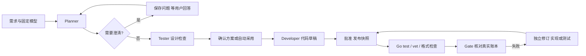

# 本地模型、Runtime 与恢复：结合代码说明

2026-10-03。本轮主要修复本地 Planning 看似卡死的问题，并接入可选硬件面板。最终验收结果见 本轮进展。

## 1. 这次 Planning 为什么看起来卡死

你的任务 `9620c8ba3e5946b3b53ab28666e5cd84` 实际已完成一次 Planner 调用。耗时约 14.61 秒，其中约 11.43 秒在加载模型；输出 164 tokens，生成阶段约 60.64 tokens/s。模型提出了随机算法、范围和输出方式三个问题，业务状态已经是 `waiting_for_input`。

故障发生在随后读取页面数据时：

1. `runtime/roles.py` 保存了模型配置快照，并生成 `model_configuration_frozen` 事件。
2. 旧实现把事件 payload 保存为一个字符串引用。
3. `application/projects.py` 构建页面角色进度时，对所有 payload 调用 `.get()`；字符串没有这个方法。
4. HTTP 请求异常，前端无法取得项目视图。旧轮询逻辑又丢掉任务跟踪，于是仍看到 Planning，实际问题却没有显示出来。

修改后，新事件明确保存 `{snapshot_ref, mode}`；读取项目视图和 artifact 的代码兼容已有标量事件，不改写历史。`Console.artifact()` 还从运行元数据直接取得快照引用。已经通过真实 HTTP 重新读取原任务的问题；没有替你回答原任务的问题。

相关代码：[角色调用](../../src/masa/runtime/roles.py)、[项目视图](../../src/masa/application/projects.py)、[artifact 读取](../../src/masa/application/console.py)。回归测试 `test_web.py` 使用真实 Settings/ChatProvider 配置身份，模拟本地响应，同时插入旧事件；因此能够覆盖之前仅靠 fake provider 漏掉的情况。

## 2. 当前结构：每层只负责一件事

```text
frontend/src            （2026-10-03 起为 TypeScript 独立前端，结构见 PLAN_FRONTEND_REDESIGN 第 4 节）
  api/queries.ts        服务端状态与自适应轮询
  app/activity.tsx      后台任务统一跟踪与“跟随执行”
  features/topbar       顶部阶段、时间、最近速率、文件进度
  features/settings     本地模型、硬件、后台诊断
```

Planner、Tester、Developer 是不同职责，不是必须同时运行的三个进程。现在同一个选定模型可以依次承担这些角色。Coordinator 决定接下来做什么，RoleRuntime 记录真实模型请求，Go runner 执行真实工具。页面的角色状态来自事件和业务状态，而不是用固定图假装某个 Agent 已完成。



Tester 设计检查不等于执行 `go test`。真实测试只能在整套代码发布后运行。Gate 不负责问模型“通过了吗”，它核对当前快照对应的真实工具结果。后台 worker 结束、模型调用结束、Gate 通过是三件不同的事。Gate只证明选定检查通过，本轮另用独立CLI探针实际构建和运行，检查入口可执行与输出行为。

## 3. Ollama 控制器具体做什么

页面通过 MASA 的 `/api/ollama` 和 `/api/ollama/action`，由 `OllamaControl` 访问固定的 `127.0.0.1:11434`。不是把用户输入拼成 shell 命令。

| 页面功能 | 实际接口 | 含义 |
|---|---|---|
| 已安装模型 | `GET /api/tags` | 磁盘模型、大小、参数规模、量化、digest |
| 已加载模型 | `GET /api/ps` | 此刻模型内存、显存、上下文、驻留情况 |
| 模型详情 | `POST /api/show` | 参数、能力与模型元数据 |
| 加载/释放 | `POST /api/generate`，空提示与 keep_alive | 管理模型驻留，不生成项目 |
| 真实测速 | `POST /api/chat` | 一次小型角色协议调用，保存真实计数 |
| 用于项目 | `Settings.save()` | 选择或创建本地 profile，改变新任务默认值 |

模型列表和驻留字段分别来自官方 [tags](https://docs.ollama.com/api/tags) 与 [ps](https://docs.ollama.com/api/ps) 接口。页面显示命令便于理解，但没有任意终端、下载、删除或服务重启入口。

Ollama 是推理服务。Go 工具链仍通过 MASA runner 执行，两者不共享“让模型执行命令”的权限。MASA 的项目生成和控制操作共享一个后台槽，运行期间不允许再加载、释放或测速争抢资源；其他终端或软件仍可能影响 Ollama。

## 4. 多模型到底怎样切换

有两个容易混淆的切换：

**选择项目模型**：点击“用于项目 / 切换默认”，后端确认这个完整 tag 已安装，复用或创建对应本地 profile。新任务从 Settings 取这个 profile。`ChatProvider.respond()` 的请求体里写入具体 `model` 名称，Ollama 根据名称进行推理。仅选默认不会立即加载模型或强制卸载另一个模型。

**管理模型内存**：点击加载或释放，改变 Ollama 的模型驻留。加载不是给某个运行任务换身份；释放也不是项目取消。磁盘大小、模型显存占用、显卡总显存分别显示，不能相互替代。

任务启动后保存无密钥配置快照。`Settings.provider(snapshot=...)` 恢复旧参数；`RoleRuntime.call()` 检查输入、provider 和快照一致性。切换默认后，旧任务不会悄悄改用新模型。删除、禁用或改变原目的地址时，恢复明确拒绝。当前尚未冻结本地权重 digest，同一 tag 的权重被外部替换仍是后续需要补齐的边界。

本轮仍是固定模型模式。等级、优先级、角色限制已能配置，**自动本地失败升级 API、按角色自动分配模型都没有启用**。代码中选择另一个模型，必须是明确的新任务或修订；不能覆盖旧调用身份。后续唯一计划见 PLAN_MULTI_MODEL。

## 5. 为什么改成逐文件生成

历史 GLM 多文件请求曾达到 8192 输出 tokens 后被截断。增加输出上限不能保证消除重复输出。现在新建原生 Ollama 草稿使用 `generation_mode: files-v1`：

1. 根据已批准 module 直接构造标准 `go.mod`，不浪费模型调用。
2. 先逐个生成实现文件，最后生成测试。
3. 每次提供完整批准规格、检查计划、目标路径和已有文件，只允许返回目标文件。
4. 调用标识分别为 `initial`、`file:2` 等，沿用同一个 Developer 职责及既有 RoleRuntime。
5. 每个完整响应落独立 artifact，元数据保存 `gen_progress` 与 `partial_files_ref`。
6. 整套完成后，仍由 `validate_files()` 校验全部批准路径和模块，再提交审核。

顶部显示“完成几个文件/共几个文件”和当前路径；这只是文件进度，不是 token 百分比。中断恢复会重新组合已保存的完整响应，完成的文件不重复调用；请求已发出但响应未知则停下，不能通过换 invocation ID 绕过保护。

单文件 JSON schema 仅限定一个路径。修实现的 schema 不包含测试或 go.mod，修测试的 schema 只包含既有 `_test.go`；Domain 继续独立核对。CLI入口还须声明 package main，跳过文件头注释读取声明；这不是完整Go解析器，语法与类型仍靠真实Go工具。旧草稿和云端 bulk 契约保留兼容，不把旧账本迁移成新的调用方式。

本轮另补失败分类：测试文件导入私有 toolchain 包，以及带行列的 cannot use、invalid operation 等编译器类型错误，应走测试修订。普通断言失败只带测试行号，不能因为出现 expected 字样就去改测试。Qwen真实案例正是旧分类漏掉类型错误，导致重复修实现；对应回归还确认实现文件相同诊断不被误归类。

逐文件调用会增加请求次数与重复输入。这次优先减少大输出失控，并获得更细的恢复点；上下文裁剪、接口契约摘要和总预算是下一步，不能宣称当前已经减少总 token。

## 6. 恢复、取消和诊断

**轮询失败**：前端对项目列表、bootstrap、任务、detail、项目视图分别保存读取结果。一个端点失败不再抹掉 job ID。刷新后可从 `bootstrap.active_job` 发现本进程还活着的 worker；手动浏览历史仍保留。

**重复启动**：服务在构造 Console/Jobs 之前取得 `console.lock`，一直持有到关闭。此前第二个服务即使绑定端口失败，也会先把运行任务标中断；现在不同端口也不能同时占同一状态目录。此锁与短期 runtime 工具锁分开。

**取消**：独立 SQLite 事务立即保存取消意图，不等待持有 Console 锁的推理调用。当前 HTTP 请求仍需返回或超时，页面明确显示正在收尾；不会启动下一文件或新修复。收到完整响应后先保存调用事实，再检查取消/期限，不能把已取消业务覆盖成待审核。超时取模型限制与任务剩余时间的较小值。不把取消解释为模型能力失败。

**诊断**：意外后端异常返回 JSON 500 和 request ID，避免直接断开连接。`service-errors.jsonl` 位于忽略的 `.masa`，有大小轮转；只写异常类型、代码位置、固定路由类别，不写异常原文、请求正文、源码或密钥。控制页“后台诊断”可读取和复制最近记录。项目模型/工具失败证据仍从项目日志查看，不能用服务日志代替 Gate。

速率来自真实 `eval_count / (eval_duration / 1e9)`，响应时长单位为纳秒，见官方 [chat](https://docs.ollama.com/api/chat) 文档。当前请求不是流式：期间显示时间、阶段和文件进度，响应结束才有本次实测速率；最近速率不是当前瞬时吞吐。

## 7. 硬件面板与下一步

控制页展开“硬件与资源”。后端固定 `nvidia-smi` 查询 GPU 名称、显存总/用/空闲与利用率；Windows CIM 查询物理内存、模块容量与标称/配置频率。普通用户查询，不提权，不发给模型。采集限制为短超时、32 KiB 输出、10 秒缓存；失败显示未知，不阻塞项目功能。

本机实际读到 RTX 5070 Ti、16303 MiB 总显存、四条 16 GiB 内存；CIM 报告的模块频率为 3600 MHz。频率是固件报告值，不是实时频率或带宽。总量和可用量可能含系统/驱动保留，不强行使其相加一致。字段依据见 [NVIDIA SMI](https://docs.nvidia.com/deploy/nvidia-smi/index.html) 和 [Win32_PhysicalMemory](https://learn.microsoft.com/en-us/windows/win32/cimwin32prov/win32-physicalmemory)。

下一步先用相同实际需求比较思考开关和更小本地模型，评估首轮通过率与修复次数；再加上下文准入、权重 digest、跨阶段总预算。只有这些边界稳定后，再实现有界模型升级。流式展示仍只做预览，不能批准半段响应；持续追加需求要绑定新的需求版本，不直接修改已经冻结的规格或测试。
